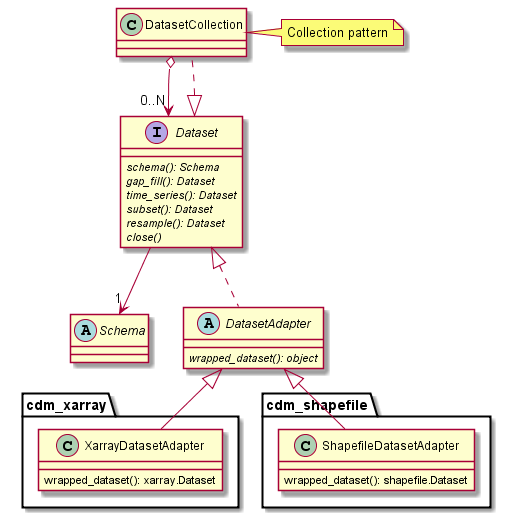
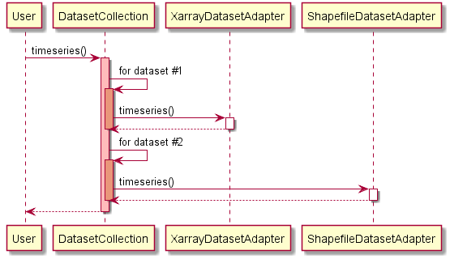
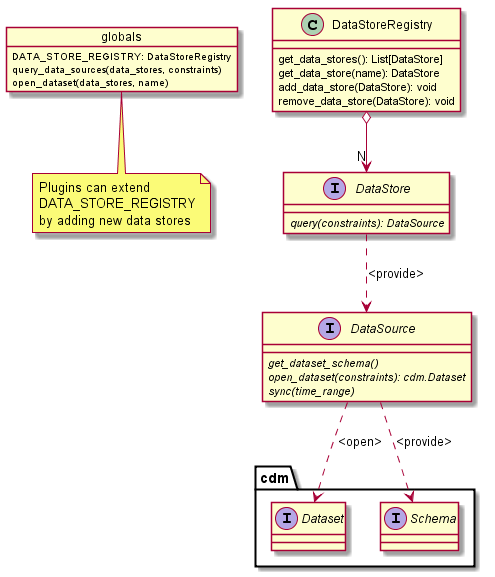
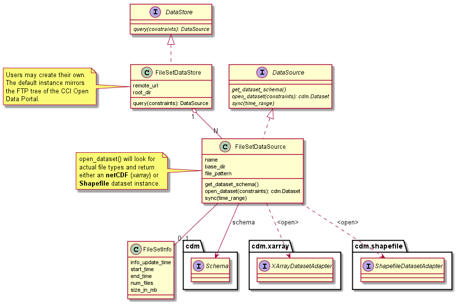
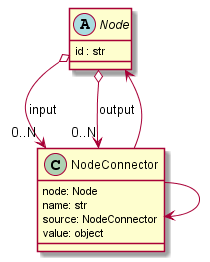

.. _Electron: http://electron.atom.io/
.. _CCI Open Data Portal: http://cci.esa.int/
.. _THREDDS: http://www.unidata.ucar.edu/software/thredds/current/tds/
.. _xarray: http://xarray.pydata.org/en/stable/
.. _Fiona: http://toblerity.org/fiona/
.. _CCI Toolbox User Requirements Document: https://www.dropbox.com/s/0bhp6uwwk6omj8k/CCITBX-URD-v1.0Rev1.pdf?dl=0

============
Architecture
============


Scope and Purpose
=================

This chapter describes the internal, technical design of the CCI Toolbox that has been developed on the basis of the
`CCI Toolbox User Requirements Document`_ (URD), the climate data exploitation :doc:`use_cases` defined in the URD, as
well as the abstract :doc:`op_specs` that have been derived from both.

This architecture description tries to reflect the current software design of the CCI Toolbox and should provide the
big picture of the software to the development team and should help other programmers getting an overview.

Please note that this architecture description does not necessarily reflect the CCI Toolbox application programming
interface (API). The actual public API comprises a relatively stable subset of the components, types, interfaces, and
variables describes here and is described in chapter :doc:`api_reference`.


Overview
========

The CCI Toolbox comprises a "Core" (Python) which provides the a command-line interface (CLI), application
programming interface (API), and a web API interface (WebAPI), and also implements all required climate data
visualisation, processing, and analysis functions. It defines a common climate data model and provides a common
framework to register, lookup and invoke operations and workflows on data represented in the common data model.

The CCI Toolbox graphical user interface, the GUI, is based on web technologies, i.e. JavaScript and HTML-5, and
communicates with the Python core via its WebAPI. The GUI is designed as a native desktop application (uses Electron_
technology for the desktop operating system integration). It will us a Python (RESTful) web server running on the
user's computer and providing the CCI Toolbox' WebAPI service to the GUI. This design allows for later
extensions towards a web application with possibly multiple remote WebAPI services.

The following :numref:`uml_modules` shows the CCI Toolbox GUI, CCI Toolbox Core, and the CCI Portal. Note that although the CCI
Toolbox GUI and Core are shown as separate nodes, they are deployed as a single software installation on the user's
computer.

The ESA `CCI Open Data Portal`_ is the central climate data provider for the CCI Toolbox. It provides time series of essential
climate variables (ECVs) in various spatial and temporal resolutions in netCDF and Shapefile format. At the time of
writing (June 2016), the only operational data access service is via FTP. However, the CCI Portal will soon offer
also data access via a dedicated THREDDS_ server and will support *OPEeNDAP* and *OGC WCS* services.

.. _uml_modules:

.. figure:: _static/uml/modules.png
   :scale: 100 %
   :align: center

   CCI Toolbox GUI, CCI Toolbox Core, and the CCI Portal.

Note that although the CCI Toolbox GUI and Core are shown in :numref:`uml_modules` as separate nodes, they are combined in
one software installation on the user's computer.

The CCI Toolbox Core comprises four main packages of which are described in the following four sections.

.. _ect_core:

Package ``ect.core``
--------------------

The Python package ``ect.core`` is the heart of the CCI Toolbox architecture. It provides a common framework for
climate data I/O and processing and defines the user API. Although designed for climate tooling and use with climate
data the framework and API is more or less application-independent. ``ect.core`` has no dependency on the other
CCI Toolbox packages ``ect.ds``, ``ect.ops``, and ``ect.ui``.

The ``ect.core`` package

* defines the CCI Toolbox' common data model
* provides the means to read climate data and represent it in the common data model
* provides the means to process / transform data in the common data model
* to write data from the common data model to some external representation

As a framework, ``ect.core`` allows plugins to extend the CCI Toolbox capabilities. The most interesting extension
points are

* climate data stores (DS) that will be added to the global data store registry
* climate data visualisation, processing, analysis operations (OP) that will be added to the global operations registry

The modules contained in the ``ect.core`` are all essential and described in detail in the following sub-sections:

* module ``cdm`` - :ref:`cdm`
* module ``io`` - :ref:`io`
* module ``op`` - :ref:`op`
* module ``workflow`` - :ref:`workflow`

There are some utility modules included in ``ect.core`` not included in :numref:`uml_modules` but nevertheless
they are an important part of the API:

* module ``monitor`` - :ref:`monitor`
* module ``plugin`` - :ref:`plugin`
* module ``util`` - Common utility functions

.. _ect_ds:

Package ``ect.ds``
------------------

The Python package ``ect.ds`` contains specific climate data stores (DS). Every module in this package is
dedicated to a specific data store. The ``esa_cci_ftp`` module provides the data store that represents the
ESA CCI Data Access Portal's FTP data.

The package ``ect.ds`` is a *plugin* package. The modules in ``ect.ds`` are activated during installation
and their data sources are registered once the module is imported. In fact, no module in package ``ect.core``
has any knowledge about the package ``ect.ds``.

.. _ect_ops:

Package ``ect.ops``
-------------------

The Python package ``ect.ops`` contains (climate-)specific visualisation, processing and analysis functions.
Every module in this package is dedicated to a specific operation implementation.
For example the ``timeseries`` module provides an operation that can be used to extract time series from
datasets. Section :ref:`op` describes the registration, lookup, and invocation of operations,
section :ref:`workflow` describes how an operation can become part of a workflow.

The chapter :doc:`op_specs` provides abstract descriptions of the individual operations in this package.

Similar to ``ect.ds``, the package ``ect.ops`` is a *plugin* package, only loaded if requested, and no module in
package ``ect.core`` has any knowledge about the package ``ect.ops``.

.. _ect_ui:

Package ``ect.ui``
------------------

The package ``ect.ui`` comprises the modules ``ws`` which implements a RESTful web service that offers the WebAPI
interface for the CCI Toolbox GUI.

The ``cli`` module is described in section :ref:`cli`.


.. _Unidata's Common Data Model: http://www.unidata.ucar.edu/software/thredds/current/netcdf-java/CDM/

.. _cdm:

Common Data Model
=================

Considering the ESA CCI data products as primary source for the CCI Toolbox, a *Common Data Model* (CDM) has to be designed
for both *netCDF CF* formatted datasets as well as for the *ESRI Shapefile* format.

The most important aspect of a common data model in the context of the CCI Toolbox is the applicability of operations
to climate datasets independently of the their underlying format.

Both the netCDF CF and Shapefile format have a long-time tradition in geospatial data domain. Very good, well tested
and popular libraries exist for them in a variety of programming languages. Furthermore, for the netCDF (CF) and HDF5 datasets
there exists already the `Unidata's Common Data Model`_. Creating a new common data model which incorporates netCDF,
HDF5 and Shapefiles models would first be an enormous effort and secondly, user's of the CCI Toolbox API could be
unhappy to deal with yet another API for netCDF, HDF5, or Shapefiles.

Therefore it has been decided to make the CCI Toolbox CDM a lightweight wrapper around existing data models that exists already
for a given format. This wrapper will just make sure that (climate) operations can be performed on the different
data models. CCI Toolbox users can still decide to switch to the underlying, dedicated data model of a format or stay
with he lightweight wrapper that can peroform toolbox operations on a variety of data formats.
However, this approach burdens the CCI Toolbox developer with having to implement each operation for each the
supported data formats. But in doing so comes another advantage: the operations may be implemented very effectively
and performant with respect to a given data layout.


The CCI Toolbox CDM is implemented in the ``cdm`` module and comprises the following types:

.. _uml_cdm:



   DatasetCollection, Dataset, DatasetAdapter


The ``Dataset`` interface defines the abstract operations that can be performed an all supported data formats. The
``DatasetAdapter`` is the base class for all ``Dataset`` implementations for a given data model. :numref:`uml_cdm`
shows two implementations:

* ``XarrayDatasetAdapter``: a ``Dataset`` implementation for the netCDF CD CDM provided by the excellent xarray_ Python library
* ``ShapefileDatasetAdapter``: a ``Dataset`` implementation for ESRI Shapefiles data models, e.g. as prvided by the
  Fiona_ Python library

The ``Schema`` is a meta-model that describes a dataset's supposed structure and and contents.
It names the variables and dimensions contained in a dataset, their data types, units.

.. _uml_cdm_seq_2:



   Dataset collection delegation

A ``DatasetCollection`` is first a concrete collection of datasets and secondly it also implements the
``Dataset`` interface. The ``DatasetCollection`` operation implementations will usually invoke the same operation
on the children of the collection and either return a new collection or aggregate the result in some way. For example,
the *timeseries* operation would extract the time series from netCDF and Shapefiles and then combine the result
as a new instance of either one or the other type as shown in :numref:`uml_cdm_seq_2`.


In general, dataset collection delegate operations to their contained datasets and combine the individual results.

Python implementation note: plugins may dynamically extend the ``DatasetCollection``, ``Dataset``, and
``DatasetAdapter`` types by *monkey patching* new operations into them.

.. _io:

Data Stores and Data Sources
============================

In the CCI Toolbox, a *data store* represents something that can be queries for climate *data sources*.

For example, the ESA CCI Open Data Portal currently (June 2016) provides climate data products for around 13 essential
climate variables (ECVs). Each ECV comes in different spatial and temporal resolutions, may originate from various
sensors and may be provided in various processing versions. A *data source* refers to such a unique ECV occurence.

The CCI Toolbox ``io`` module comprises the following abstract types:

.. _uml_io:



   DataStore and DataSource

The ``DataStoreRegistry`` manages the set of currently known data stores. The default data store registry is accessible
via the variable ``DATA_STORE_REGISTRY``. Plugins may register new data stores here. There will be at least one
data store available which is by default the data store that mirrors parts of the CCI Portal's FTP tree on the user's
computer.

The ``DataStore.query()`` allows for querying a data store for data sources given some optional constraints.

The actual data of a data source can be provided by calling the ``DataSource.open_dataset()`` method
which provides instances of the ``Dataset`` type which has been introduced in the former section :ref:`cdm`.

The ``DataSource.sync()`` method is used to explicitly synchronise the remote content of a data store
with locally cached data.


The ``FileSetDataStore`` represents a special data store which refers to a directory tree in the file system. A
``FileSetDataSource`` refers to set of files that is identified by a path pattern, usually comprising the measurement's
year, month, day of month as variables:

.. _uml_io_file_set:



   FileSetDataStore and FileSetDataSource

A common usage of the ``FileSetDataStore`` is to act as a local *cache* for some remote data service
(property ``remote_url``), e.g. for the CCI FTP service.
Another common use case of the is to let users add their own
local data stores to the CCI Toolbox.


.. _op:

Operation Management
====================

The CCI Toolbox ``op`` module allows for the registration, lookup and controlled invocation of
*operations*. Operations can be run from the CCI Toolbox command-line (see next section :ref:`cli`),
may be referenced from within processing *workflows* (see next section :ref:`workflow`), or may be invoked from
from the WebAPI (see :numref:`uml_modules`) as a result of a GUI request.

An operation is represented by the ``OpRegistration`` type (TBC: may rename to Operation) which comprises any Python
callable (function, lambda expression, etc.) and some additional meta-information ``OpMetaInfo`` that describes the
operation and allows for automatic input validation, input value conversion, monitoring. The ``OpMetaInfo`` object
specifies an operation's signature in terms of its expected inputs and produced outputs.

The CCI Toolbox framework may invoke an operation with a ``Monitor`` object, if the operation supports it. The operation
can report processing progress to the monitor or check th monitor if a user has requested to cancel the (long running)
operation.

.. _uml_op:

.. figure:: _static/uml/op.png
   :scale: 75 %
   :align: center

   OpRegistry, OpRegistration, OpMetaInfo


Operations are registered in operation registries of type ``OpRegistry``, the default operation registry is
accessible via the global, read-only ``OP_REGISTRY`` variable. Plugins may register new operations. A convenient way for
developers is to use specific *decorators* that automatically register an annotated Python function or class
and add additional meta-information to the operation registration's ``OpMetaInfo`` object. They are

* ``@op(properties)`` registers the function as operation and adds meta-information *properties* to the operation.
* ``@op_input(name, properties)`` adds extra meta-information *properties* to a named function input (argument)
* ``@op_output(name, properties)`` adds extra meta-information *properties* to a named function output
* ``@op_return(name, properties)`` adds extra meta-information *properties* to a single function output (return value)

Note that if a Python function defines an argument named ``monitor``, it will not be considered as an operation input.
Instead it is assumed that it is a monitor instance passed in by the CCI Toolbox, e.g. when invoking an operation from the
command-line or if an operation is performed as part of a workflow as described in the next section.


.. _workflow:

Workflow Management
===================


Many analyses on climate data can be decomposed into some sequential steps that perform some fundamental operation.
To make such recurring chains of operations reusable and reproduceable, the CCI Toolbox contains a simple but powerful
concept which is implemented in the ``workflow`` module.

A *workflow* is a network or to be more specific, a directed
acyclic graph of *steps*. A step execution may invoke a registered *operation* (see section :ref:`op`),
may evaluate a simple Python expressions, may spawn an external process, and invoke another workflow.

An great advantage of using workflows instead of, e.g. programming scripts, is that that the invocation of steps
is controlled and monitored by the CCI Toolbox  framework. This allows for task cancellation by users, task progress
reporting, input/output validation. Workflows can be composed by a dedicated GUI or written by hand in a text editor,
e.g. in JSON, YAML or XML format. Workflow steps can even be used to automatically ingest provenance information
into the dataset outputs for processing traceability and later data history reconstruction.

:numref:`uml_workflow` shows the types and relationships in the ``workflow`` module:

* A ``Node`` has zero or more *inputs* and zero or more *outputs* and can be invoked.
* A ``Workflow`` is a ``Node`` that is composed of ``Step`` objects.
* A ``Step`` is a ``Node`` that is part of a ``Workflow`` and performs some kind of data processing.
* A ``OpStep`` is a ``Step`` that invokes an ``OpRegistration``.
* A ``ExprStep`` is a ``Step`` that executes a Python expression string.
* A ``WorkflowStep`` is a ``Step`` that executes a ``Workflow`` loaded from an external (JSON) resource.

.. _uml_workflow:

.. figure:: _static/uml/workflow.png
   :scale: 100 %
   :align: center

   Workflow, Node, Step

Like the ``OpRegistration``, every ``Node`` has an associated ``OpMetaInfo`` object specifying the node's
signature in terms of its inputs and outputs. The actual ``Node`` inputs and outputs are modelled by the
``NodeConnector`` class. As shown in :numref:`uml_workflow_node_connector`, a given node connector belongs to exactly
one ``Node`` and represents either a named input or output of that node. A node connector has a name, a property
``source``, and a property ``value``. If ``source`` is set, it must be another ``NodeConnector`` that provides the
actual connector's value. The value of the ``value`` property can be basically anything that has an external (JSON)
representation.

.. _uml_workflow_node_connector:



   NodeConnector

A workflow is required to specify its inputs and outputs. Input source may be left unspecified, while it is mandatory to
connect the workflow's outputs to outputs of contained step nodes or inputs of the workflow. A workflow's step nodes
are required to specify all of their input sources. Valid input sources for a step node are the workflow's inputs or
other step node's outputs, or constant values.

.. _uml_workflow_seq:

.. figure:: _static/uml/workflow_seq.png
   :scale: 75 %
   :align: left

   Workflow invokes its steps

Similar to operations, users can run workflows from the command-line (see section :ref:`cli`),
or may be invoked from the WebAPI (see :numref:`uml_modules`) due to a GUI request. The CCI Toolbox will always
call workflows with a ``Monitor`` instance (see section :ref:`monitor`) and therefore sub-monitors will be passed to the
contained steps.

The ``workflow`` module is independent of any other CCI Toolbox module so that it may later be replaced by a
more advanced workflow management system.

.. _monitor:

Task Monitoring
===============

The ``monitor`` module defines the abstract base class ``Monitor`` that that may be used by functions and methods
that offer support for observation and control of long-running tasks. Concrete ``Monitor``s may be implemented by
API clients for a given context. The ``monitor`` module defines two useful implementations.

.. _uml_monitor:

.. figure:: _static/uml/monitor.png
   :scale: 100 %
   :align: right

   Monitor and sub-classes


* ``ConsoleMonitor``: a monitor that is used by the command-line interface
* ``ChildMonitor``: a sub-monitor that can be passed to sub-tasks called from the current task

In addition, the ``Monitor.NULL`` object, is a monitor singleton that basically does nothing. It is used instead
of passing ``None`` into methods that don't require monitoring but expect a non-``None`` argument value.


.. _cli:

Command-Line Interface
======================

The primary user interface of the CCI Toolbox Core is a command-line interface (CLI) executable named ``ect``.

The CLI can be used to list available data sources and to synchronise subsets of remote data store contents on the
user's computer to make them available to the CCI Toolbox. It also allows for listing available operations as well
as running operations and workflows.

.. _uml_cli:

.. figure:: _static/uml/cli.png
   :scale: 100 %
   :align: center

   CLI Command and sub-classes

The CLI uses (sub-)commands for specific functionality. The most important commands are

* ``run`` to run an operation of workflow with given arguments.
* ``ds`` to display data source information and to synchronise remote data sources with locally cached versions of it.
* ``list`` to list registered data stores, data sources, operations and plugins

Each command has its own set of options and arguments and can display help when used with the option ```--help``
or ``-h``.

Plugins can easily add new CLI commands to the CCI Toolbox by implementing a new ``Command`` class and registering it
in the ``COMMAND_REGISTRY`` singleton.

Given here is an early version of the CCI Toolbox CLI usage::

   $ ect -h
   usage: ect [-h] [--version] COMMAND ...

   ESA CCI Toolbox command-line interface, version 0.1.0

   positional arguments:
     COMMAND     One of the following commands. Type "COMMAND -h" to get command-
                 specific help.
       list      List items of a various categories.
       run       Run an operation OP with given arguments.
       ds        Data source operations.
       cr        Print copyright information.
       lic       Print license information.
       doc       Display documentation in a browser window.

   optional arguments:
     -h, --help  show this help message and exit
     --version   show program's version number and exit


.. _plugin:

Plugins Concept
===============

A CCI Toolbox *plugin* is actually any Python module that extend one of the registry singletons introduced in the
previous sections:

* Add a new ``ect.core.io.DataStore`` object to ``ect.core.io.DATA_STORE_REGISTRY``
* Add a new ``ect.core.op.OpRegistration`` object to ``ect.core.io.OP_REGISTRY``
* Add a new ``ect.cli.Command`` object to ``ect.cli.COMMAND_REGISTRY``

It could also be a Python module that modifies or extends existing CCI Toolbox types by performing some
controlled *monkey patching*.

.. _uml_plugin:

.. figure:: _static/uml/plugin.png
   :scale: 100 %
   :align: left

   The ``plugin`` module

The CCI Toolbox will call any plugin functions that are registered with the ``ect_plugins`` entry point
of the standard Python ``setuptools`` module. These entry points can be easily provided in the plugin's
``setup.py`` file. The value of each entry point must be a no-arg initialisation function, which is
called by the CCI Toolbox at given time. After successful initialisation the plugin is registered
in the ``PLUGIN_REGISTRY`` singleton.

In fact the ``ect.ds`` and ``ect.ops`` packages of the CCI Toolbox Core are such plugins registered
with the same entry point::

   setup(
       name="ect-core",
       version=__version__,
       description='ESA CCI Toolbox Core',
       license='GPL 3',
       author='ESA CCI Toolbox Development Team',
       packages=['ect'],
       entry_points={
           'console_scripts': [
               'ect = ect.ui.cli:main',
           ],
           'ect_plugins': [
               'ect_ops = ect.ops:ect_init',
               'ect_ds = ect.ds:ect_init',
           ],
       },
       ...
   )

