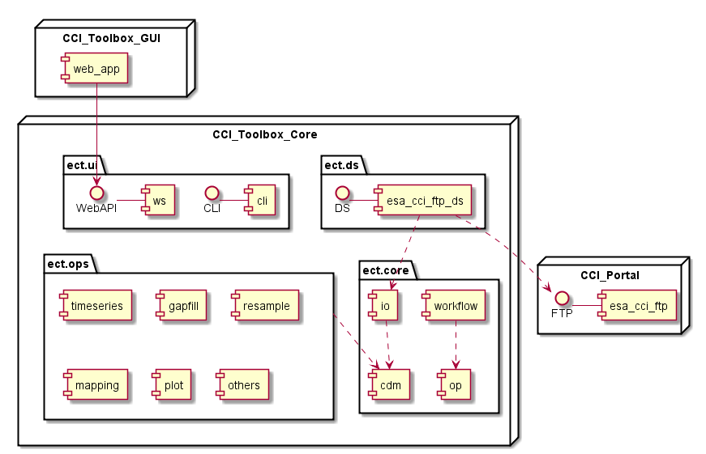
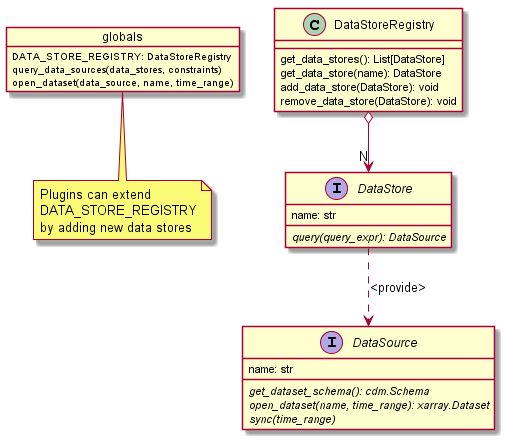
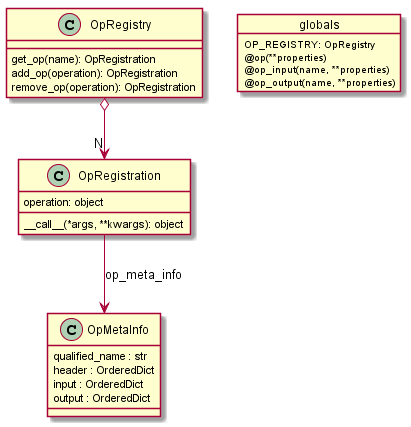
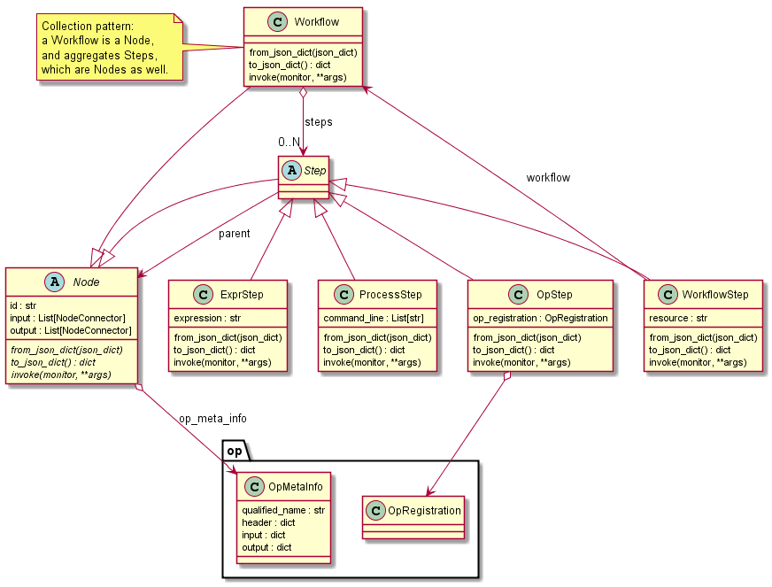
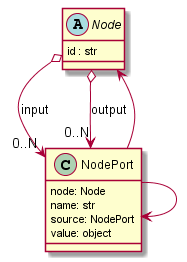
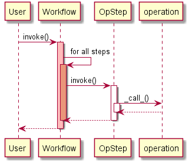
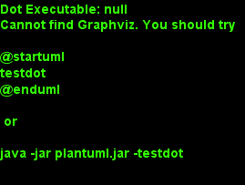
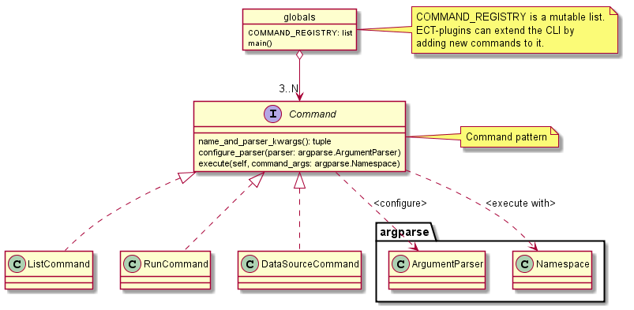

.. _Electron: http://electron.atom.io/
.. _CCI Open Data Portal: http://cci.esa.int/
.. _THREDDS: http://www.unidata.ucar.edu/software/thredds/current/tds/
.. _xarray: http://xarray.pydata.org/en/stable/
.. _xarray.Dataset: http://xarray.pydata.org/en/stable/data-structures.html#dataset
.. _xarray.DataArray: http://xarray.pydata.org/en/stable/data-structures.html#dataarray
.. _GeoPandas: http://geopandas.org/
.. _geopandas.GeoDataFrame: http://geopandas.org/data_structures.html#geodataframe
.. _geopandas.GeoSeries: http://geopandas.org/data_structures.html#geoseries
.. _Fiona: http://toblerity.org/fiona/
.. _CCI Toolbox User Requirements Document: https://www.dropbox.com/s/0bhp6uwwk6omj8k/CCITBX-URD-v1.0Rev1.pdf?dl=0
.. _Unidata Common Data Model: http://www.unidata.ucar.edu/software/thredds/current/netcdf-java/CDM/
.. _CF Conventions: http://cfconventions.org/cf-conventions/v1.6.0/cf-conventions.html
.. _Simple Features Standard: https://en.wikipedia.org/wiki/Simple_Features
.. _numpy: http://www.numpy.org/
.. _numpy ndarrays: http://docs.scipy.org/doc/numpy/reference/arrays.ndarray.html
.. _pandas: http://pandas.pydata.org/


============
Architecture
============

This chapter describes the internal, technical design of the CCI Toolbox that has been developed on the basis of the
`CCI Toolbox User Requirements Document`_ (URD), the climate data exploitation :doc:`use_cases` defined in the URD, as
well as the abstract :doc:`op_specs` that have been derived from both.

This architecture description tries to reflect the current software design of the CCI Toolbox and should provide the
big picture of the software to the development team and should help other programmers getting an overview.

Please note that this architecture description does not necessarily reflect the CCI Toolbox application programming
interface (API). The actual public API comprises a relatively stable subset of the components, types, interfaces, and
variables describes here and is described in chapter :doc:`api_reference`.


Overview
========

The CCI Toolbox comprises a "Core" (Python) which provides the a command-line interface (CLI), application
programming interface (API), and a web API interface (WebAPI), and also implements all required climate data
visualisation, processing, and analysis functions. It defines a common climate data model and provides a common
framework to register, lookup and invoke operations and workflows on data represented in the common data model.

The CCI Toolbox graphical user interface, the GUI, is based on web technologies, i.e. JavaScript and HTML-5, and
communicates with the Python core via its WebAPI. The GUI is designed as a native desktop application (uses Electron_
technology for the desktop operating system integration). It will us a Python (RESTful) web server running on the
user's computer and providing the CCI Toolbox' WebAPI service to the GUI. This design allows for later
extensions towards a web application with possibly multiple remote WebAPI services.

The ESA `CCI Open Data Portal`_ is the central climate data provider for the CCI Toolbox. It provides time series of essential
climate variables (ECVs) in various spatial and temporal resolutions in netCDF and Shapefile format. At the time of
writing (June 2016), the only operational data access service is via FTP. However, the CCI Open Data Portal will soon offer
also data access via a dedicated THREDDS_ server and will support *OPEeNDAP* and *OGC WCS* services.

The following :numref:`uml_modules` shows the CCI Toolbox GUI, CCI Toolbox Core, and the CCI Open Data Portal.

.. _uml_modules:



   CCI Toolbox GUI, CCI Toolbox Core, and the CCI Open Data Portal.

Note that although the CCI Toolbox GUI and Core are shown in :numref:`uml_modules` as separate nodes, they are combined in
one software installation on the user's computer.

The CCI Toolbox Core comprises several sub-packages of which are described in the following four sections.

.. _cate_core:

Package ``cate.core``
---------------------

The ``cate.core`` Python package is most import part of the CCI Toolbox architecture. It provides a common framework for
climate data I/O and processing. Although designed for climate tooling and use with climate
data the framework and API is more or less application-independent.

The ``cate.core`` package

* defines the CCI Toolbox' common data model
* provides the means to read climate data and represent it in the common data model
* provides the means to process / transform data in the common data model
* to write data from the common data model to some external representation

As a framework, ``cate.core`` allows plugins to extend the CCI Toolbox capabilities. The most interesting extension
points are

* climate data stores that will be added to the global data store registry
* climate data visualisation, processing, analysis operations that will be added to the global operations registry

The ``cate.core`` packages comprises the essential modules which described in more detail in the following sub-sections:

* module ``ds`` - :ref:`ds`
* module ``op`` - :ref:`op`
* module ``workflow`` - :ref:`workflow`
* module ``objectio`` - :ref:`objectio`
* module ``plugin`` - :ref:`plugin`


.. _cate_ds:

Package ``cate.ds``
-------------------

The Python package ``cate.ds`` contains specific climate data stores (=ds). Every module in this package is
dedicated to a specific data store.


* The ``esa_cci_odp`` module provides the data store that allows opening datasets provided by the
  ESA CCI Open Data Portal (ODP). More specifically, it provides data for the ``esacii`` entry in
  the ESGF data service.
* The ``esa_cci_ftp`` module provides the data store that allows opening datasets provided by the
  FTP service of the ESA CCI Open Data Portal. This data store is now deprecated in favour of the
  ESGF service.

The package ``cate.ds`` is a *plugin* package. The modules in ``cate.ds`` are activated during installation
and their data sources are registered once the module is imported. In fact, no module in package ``cate.core``
has any knowledge about the package ``cate.ds`` and users never deal with its modules directly.
Instead, all registered data stores are accessible through the ``cate.core.ds.DATA_STORE_REGISTRY`` singleton.

.. _cate_ops:

Package ``cate.ops``
--------------------

The Python package ``cate.ops`` contains (climate-)specific visualisation, processing and analysis functions.
Every module in this package is dedicated to a specific operation implementation.
For example the ``timeseries`` module provides an operation that can be used to extract time series from
datasets. Section :ref:`op` describes the registration, lookup, and invocation of operations,
section :ref:`workflow` describes how an operation can become part of a workflow.

The chapter :doc:`op_specs` provides abstract descriptions of the individual operations in this package.

Similar to ``cate.ds``, the package ``cate.ops`` is a *plugin* package, only loaded if requested, and no module in
package ``cate.core`` has any knowledge about the package ``cate.ops``.


.. _cate_cli:

Package ``cate.cli``
--------------------

The package ``cate.cli`` comprises a ``main`` module, which implements the CCI Toolbox' command-line interface.

The command-line interface is described in section :ref:`cli`.

.. _cate_webapi:

Package ``cate.webapi``
-----------------------

The package ``cate.webapi`` implements the CCI Toolbox' *WebAPI* which implements a web service that allows using the
CCI Toolbox Python API from the
* Desktop GUI as well as
* the interactive commands of the CLI.

.. _cdm:

.. _cate_util:


Package ``cate.util``
---------------------

The ``cate.util`` package is fully application-independent and can be used stand-alone. Numerous,
CCI Toolbox API functions take a ``monitor`` argument used for progress monitoring of mostly long-running tasks.
The ``cate.util.monitor``  package defines the ``Monitor``class.

* module ``monitor`` - :ref:`monitor`

Package ``cate.conf``
---------------------

The ``cate.conf`` package provides Cate's configuration API. The ``cate.conf.defaults`` module defines the default
values for Cate's configuration parameters.


Common Data Model
=================

The primary data source of the first releases of the CCI Toolbox are the data products delivered by the
ESA CCI programme. Later in the project, the CCI Toolbox will also address other datasets.

The majority of the gridded ECV datasets from ESA CCI are in *netCDF-CF* format, which is a de-factor standard in
climate science. The datasets of the Land Cover CCI are provided in *GeoTIFF* format and the Glaciers and Ice Sheets
CCIs deliver their datasets in *ESRI Shapefile* format.

Ideally, the CCI Toolbox could combine the various datasets in a single *common data model* so that an API could be
designed that allows a uniform and transparent for data access. This would also allow to make a maximum of operations
work on both raster and vector data.

As this sounds reasonable at first, the team has decided not go for such a grand unification as the way how gridded
raster data is processed is substantially different from how vector data is processed. To make the majority of data
operations applicable to both data types, rasterisation (or vectorisation) would need to occur implicitly and would need
to be controlled by explicit operation parameters.

Instead, the CCI Toolbox stays with the `Unidata Common Data Model`_ and `CF Conventions`_ for raster data, and the
`Simple Features Standard`_ (ISO 19125) for vector data. This is achieved by reusing the data models and APIs
of the popular, geo-spatial Python libraries.

Raster Data
-----------

For the representation of raster or gridded data, the CCI Toolbox relies on the xarray_ Python library.
``xarray`` builds on top of numpy_, the fundamental package for scientific computing with Python,
and pandas_, the Python Data Analysis Library.

The central data structure in the CCI Toolbox is `xarray.Dataset`_, which is an in-memory representation of the data
model from the netCDF file format. Because of its generality for multi-dimensional arrays, it is also well-suited to
represent the GeoTIFF and other raster and gridded data formats. The ``xarray.Dataset`` structure is composed of the
following elements and follows the `Unidata Common Data Model`_:

:Variables: are containers for the dataset's geo-physical quantities. They are named, multi-dimensional arrays
   of type `xarray.DataArray`_ which behave quite like `numpy ndarrays`_. The dataset variables are accessible through
   the ``data_vars`` attribute, which is mapping from variable name to the multi-dimensional data arrays.

:Coordinates: To label the grid points contained in the variable arrays, **coordinates* are used. Coordinates are also
   `xarray.DataArray`_ instances and are accessible through the ``coords`` attribute, which is a mapping from coordinate
   names to the usually one-dimensional label arrays.

:Dimensions: All dimensions used by the variables and coordinates arrays are named and have a size.
   The mapping from dimension name to size is accessible through the ``dims`` attribute.

:Attributes: are used to hold metadata both for ``xarray.Dataset`` and ``xarray.DataArray`` instances.
   Attributes are accessed by the ``attrs`` attribute which is a mapping from attribute names to arbitrary values.


Vector Data
-----------

From version 1.0 on, the representation of vector data will be provided by utilising the GeoPandas_ Python library.
Similar to xarray_, also ``GeoPandas`` relies on pandas_, the Python Data Analysis Library.

Once the CCI Toolbox supports vector data, it will provide a rasterisation operation in order to convert vector data
into the raster data model, namely `xarray.Dataset`_ instances.


.. _ds:

Data Stores and Data Sources
============================

In the CCI Toolbox, a *data store* represents something that can be queries for climate *data sources*.

For example, the ESA CCI Open Data Portal currently (June 2016) provides climate data products for around 13 essential
climate variables (ECVs). Each ECV comes in different spatial and temporal resolutions, may originate from various
sensors and may be provided in various processing versions. A *data source* refers to such a unique ECV occurence.

The ``cate.core.ds`` module comprises the following abstract types:

.. _uml_ds:



   DataStore and DataSource

The ``DataStoreRegistry`` manages the set of currently known data stores. The default data store registry is accessible
via the variable ``DATA_STORE_REGISTRY``. Plugins may register new data stores here. There will be at least one
data store available which is by default the data store that mirrors parts of the FTP tree of CCI Open Data Portal
on the user's computer.

The ``DataStore.query()`` allows for querying a data store for data sources given some optional constraints.

The actual data of a data source can be provided by calling the ``DataSource.open_dataset()`` method
which provides instances of the ``xarray.Dataset`` type which has been introduced in the former section :ref:`cdm`.

The ``DataSource.sync()`` method is used to explicitly synchronise the remote content of a data store
with locally cached data.


.. _op:

Operation Management
====================

The CCI Toolbox ``cate.core.op`` module allows for the registration, lookup and controlled invocation of
*operations*. Operations can be run from the CCI Toolbox command-line (see next section :ref:`cli`),
may be referenced from within processing *workflows* (see next section :ref:`workflow`), or may be invoked from
from the WebAPI (see :numref:`uml_modules`) as a result of a GUI request.

An operation is represented by the ``OpRegistration`` type which comprises any Python
callable (function, lambda expression, etc.) and some additional meta-information ``OpMetaInfo`` that describes the
operation and allows for automatic input validation, input value conversion, monitoring. The ``OpMetaInfo`` object
specifies an operation's signature in terms of its expected inputs and produced outputs.

The CCI Toolbox framework may invoke an operation with a ``Monitor`` object, if the operation supports it. The operation
can report processing progress to the monitor or check the monitor if a user has requested to cancel the (long running)
operation.

.. _uml_op:



   OpRegistry, OpRegistration, OpMetaInfo


Operations are registered in operation registries of type ``OpRegistry``, the default operation registry is
accessible via the global, read-only ``OP_REGISTRY`` variable. Plugins may register new operations. A convenient way for
developers is to use specific *decorators* that automatically register an annotated Python function or class
and add additional meta-information to the operation registration's ``OpMetaInfo`` object. They are

* ``@op(properties)`` registers the function as operation and adds meta-information *properties* to the operation.
* ``@op_input(name, properties)`` adds extra meta-information *properties* to a named function input (argument)
* ``@op_output(name, properties)`` adds extra meta-information *properties* to a named function output
* ``@op_return(name, properties)`` adds extra meta-information *properties* to a single function output (return value)

Note that if a Python function defines an argument named ``monitor``, it will not be considered as an operation input.
Instead it is assumed that it is a monitor instance passed in by the CCI Toolbox, e.g. when invoking an operation from the
command-line or if an operation is performed as part of a workflow as described in the next section.


.. _workflow:

Workflow Management
===================


Many analyses on climate data can be decomposed into some sequential steps that perform some fundamental operation.
To make such recurring chains of operations reusable and reproduceable, the CCI Toolbox contains a simple but powerful
concept which is implemented in the ``cate.core.workflow`` module.

A *workflow* is a network or to be more specific, a directed
acyclic graph of *steps*. A step execution may invoke a registered *operation* (see section :ref:`op`),
may evaluate a simple Python expressions, may spawn an external process, and invoke another workflow.

An great advantage of using workflows instead of, e.g. programming scripts, is that that the invocation of steps
is controlled and monitored by the CCI Toolbox  framework. This allows for task cancellation by users, task progress
reporting, input/output validation. Workflows can be composed by a dedicated GUI or written by hand in a text editor,
e.g. in JSON, YAML or XML format. Workflow steps can even be used to automatically ingest provenance information
into the dataset outputs for processing traceability and later data history reconstruction.

:numref:`uml_workflow` shows the types and relationships in the ``cate.core.workflow`` module:

* A ``Node`` has zero or more *inputs* and zero or more *outputs* and can be invoked.
* A ``Workflow`` is a ``Node`` that is composed of ``Step`` objects.
* A ``Step`` is a ``Node`` that is part of a ``Workflow`` and performs some kind of data processing.
* A ``OpStep`` is a ``Step`` that invokes an ``OpRegistration``.
* A ``ExprStep`` is a ``Step`` that executes a Python expression string.
* A ``WorkflowStep`` is a ``Step`` that executes a ``Workflow`` loaded from an external (JSON) resource.

.. _uml_workflow:



   Workflow, Node, Step

Like the ``OpRegistration``, every ``Node`` has an associated ``OpMetaInfo`` object specifying the node's
signature in terms of its inputs and outputs. The actual ``Node`` inputs and outputs are modelled by the
``NodePort`` class. As shown in :numref:`uml_workflow_node_port`, a given node port belongs to exactly
one ``Node`` and represents either a named input or output of that node. A node port has a name, a property
``source``, and a property ``value``. If ``source`` is set, it must be another ``NodePort`` that provides the
actual port's value. The value of the ``value`` property can be basically anything that has an external (JSON)
representation.

.. _uml_workflow_node_port:



   Node and NodePort

Workflow input ports are usually unspecified, but ``value`` may be set.
Workflow output ports and a step's input ports are usually connected with output ports of other contained steps
or inputs of the workflow via the ``source`` attribute.
A step's output ports are usually unconnected because their ``value`` attribute is set by a step's concrete
implementation.

.. _uml_workflow_seq:



   Workflow invokes its steps

Similar to operations, users can run workflows from the command-line (see section :ref:`cli`),
or may be invoked from the WebAPI (see :numref:`uml_modules`) due to a GUI request. The CCI Toolbox will always
call workflows with a ``Monitor`` instance (see section :ref:`monitor`) and therefore sub-monitors will be passed to the
contained steps.

The ``workflow`` module is independent of any other CCI Toolbox module so that it may later be replaced by a
more advanced workflow management system.

.. _objectio:

Object Input/Output
===================

The ``objectio`` module provides two generic functions for Python object input and output:

* ``read_object(file, format)`` reads an object from a file with optional format name, if known.
* ``write_object(obj, file, format)`` writes an object to a file with a given format.

The module defines the abstract base class ``ObjectIO`` which is implemented by classes that read Python objects from
files and write them into files. ``ObjectIO`` instances represent a file format and the Python object types that
they can read from and write to files of that format. Therefore they can make a guess how suitable they are for reading
from a given file (method ``read_fitness(file)``) or writing an object to a file (method ``write_fitness(obj)``).

``ObjectIO`` instances are registered in the ``OBJECT_IO_REGISTRY`` singleton which can be extended by plug-ins.



   ObjectIO and some of its implementations


.. _monitor:

Task Monitoring
===============

The ``monitor`` module defines the abstract base class ``Monitor`` that that may be used by functions and methods
that offer support for observation and control of long-running tasks. Concrete ``Monitor``s may be implemented by
API clients for a given context. The ``monitor`` module defines two useful implementations.

.. _uml_monitor:


   Monitor and sub-classes


* ``ConsoleMonitor``: a monitor that is used by the command-line interface
* ``ChildMonitor``: a sub-monitor that can be passed to sub-tasks called from the current task

In addition, the ``Monitor.NULL`` object, is a monitor singleton that basically does nothing. It is used instead
of passing ``None`` into methods that don't require monitoring but expect a non-``None`` argument value.


.. _cli:

Command-Line Interface
======================

The primary user interface of the CCI Toolbox Core is a command-line interface (CLI) executable named ``cate``.

The CLI can be used to list available data sources and to synchronise subsets of remote data store contents on the
user's computer to make them available to the CCI Toolbox. It also allows for listing available operations as well
as running operations and workflows.

.. _uml_cli:



   CLI Command and sub-classes

The CLI uses (sub-)commands for specific functionality. The most important commands are

* ``run`` to run an operation or a *Workflow JSON* file with given arguments.
* ``ds`` to manage data sources and to synchronise remote data sources with locally cached versions of it.
* ``op`` to list and display details about available operations.
* ``ws`` to manage user *workspaces*.
* ``res`` to add, compute, modify, and display *resources* within the current user workspace.

Each command has its own set of options and arguments and can display help when used with the option ```--help``
or ``-h``.

Plugins can easily add new CLI commands to the CCI Toolbox by implementing a new ``Command`` class and registering it
in the ``COMMAND_REGISTRY`` singleton.


.. _plugin:

Plugin Concept
==============

A CCI Toolbox *plugin* is actually any Python module that extend one of the registry singletons introduced in the
previous sections:

* Add a new ``cate.core.ds.DataStore`` object to ``cate.core.ds.DATA_STORE_REGISTRY``
* Add a new ``cate.core.op.OpRegistration`` object to ``cate.core.op.OP_REGISTRY``
* Add a new ``cate.core.objectio.ObjectIO`` object to ``cate.core.objectio.OBJECT_IO_REGISTRY``
* Add a new ``cate.util.cli.Command`` object to ``cate.cli.COMMAND_REGISTRY``

It could also be a Python module that modifies or extends existing CCI Toolbox types by performing some
controlled *monkey patching*.

.. _uml_plugin:


   The ``plugin`` module

The CCI Toolbox will call any plugin functions that are registered with the ``cate_plugins`` entry point
of the standard Python ``setuptools`` module. These entry points can be easily provided in the plugin's
``setup.py`` file. The value of each entry point must be a no-arg initialisation function, which is
called by the CCI Toolbox at given time. After successful initialisation the plugin is registered
in the ``PLUGIN_REGISTRY`` singleton.

In fact the ``cate.ds`` and ``cate.ops`` packages of the CCI Toolbox Core are such plugins registered
with the same entry point::

   setup(
       name="cate-core",
       version=__version__,
       description='ESA CCI Toolbox Core',
       license='MIT',
       author='ESA CCI Toolbox Development Team',
       packages=['cate'],
       entry_points={
           'console_scripts': [
               'cate = cate.cli.main:main',
           ],
           'cate_plugins': [
               'cate_ops = cate.ops:cate_init',
               'cate_ds = cate.ds:cate_init',
           ],
       },
       ...
   )

