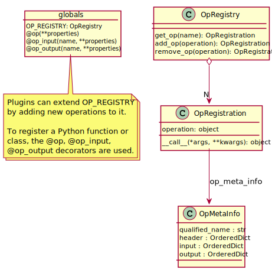
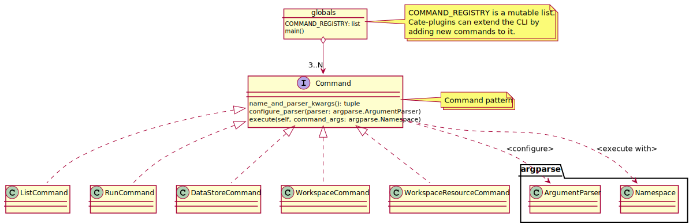

============
Architecture
============

Design Goals
============

Module Breakdown
================

Common Data Model (**cdm** Module)
==================================

.. figure:: _static/uml/cdm.svg
   :scale: 100 %
   :align: center

   Important components of the Common Data Model in the **cdm** module

Data Sources API (**io** Module)
================================

.. figure:: _static/uml/io.svg
   :scale: 100 %
   :align: center

   Important components of the **io** module

Operations and Processor Management (**op** Module)
===================================================

   Important components of the **op** module

   Important components of the **monitor** module

Workflow Management (**graph** Module)
======================================

.. figure:: _static/uml/graph.svg
   :scale: 100 %
   :align: center

   Important components of the **graph** module

.. figure:: _static/uml/graph_details.svg
   :scale: 50 %
   :align: center

   Details of the **graph** module

Command-Line Interface, CLI (**cli** Module)
============================================

   Important of the **cli** module
