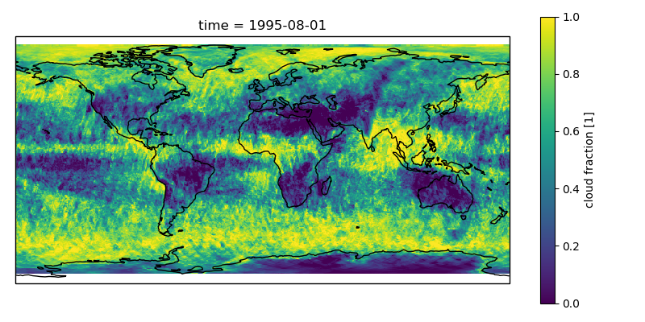
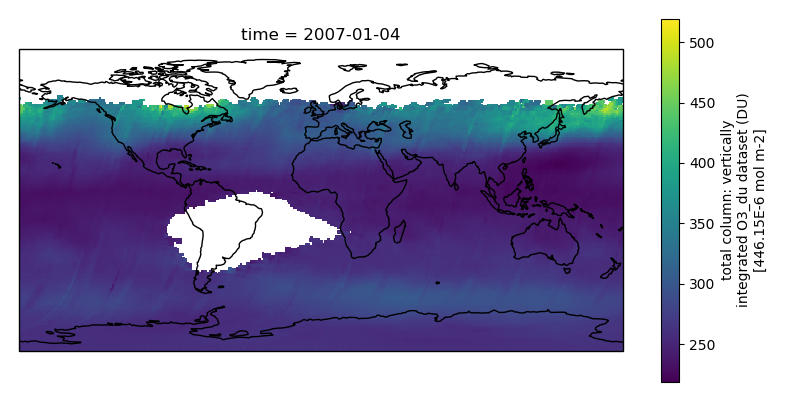
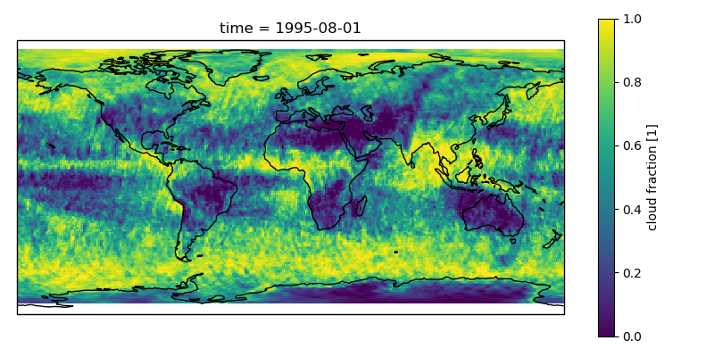
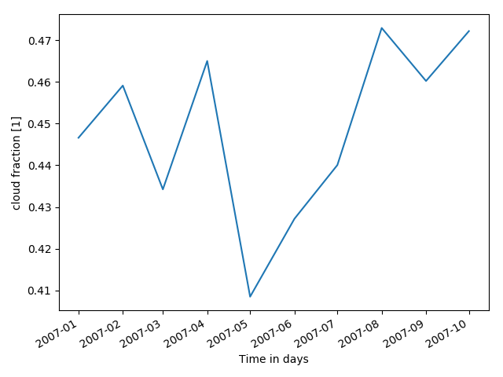

===========
Quick Start
===========

This section provides a quick start into the CCI Toolbox by demonstrating how a particular climate use case
is performed.

Refer to the :doc:`user_manual` for installing the CCI Toolbox.

The use case describes a climate scientist wishing to analyse potential correlations between the geophysical quantities *Ozone Mole Content* and *Cloud Coverage* in a certain region (see use case description for
:ref:`uc_09`). It requires the toolbox to do the following:

* Access to and ingestion of ESA CCI Ozone and Cloud data (Atmosphere Mole Content of Ozone and Cloud Cover)
* Geometric adjustments (coregistration)
* Spatial (point, polygon) and temporal subsetting
* Visualisation of time series
* Correlation analysis, scatter-plot of correlation statistics, saving of image and correlation statistics

Using the CLI
=============

In the following, a demonstration is given how the use case described above is performed using the CCI Toolbox'
:doc:`user_manual/um_cli`.

-----------------
Dataset Ingestion
-----------------

Use ``ds list`` to list available products. You can filter them according to some name.

.. code-block:: console

    $ cate ds list -n ozone
    3 data sources found
       1: esacci.OZONE.day.L3S.TC.GOME-2.Metop-A.MERGED.fv0100.r1
       2: esacci.OZONE.day.L3S.TC.GOME.ERS-2.MERGED.fv0100.r1
       3: esacci.OZONE.mon.L3.NP.multi-sensor.multi-platform.MERGED.fv0002.r1

.. code-block:: console

    $ cate ds list -n cloud
    14 data sources found
       1: esacci.CLOUD.day.L3U.CLD_PRODUCTS.AVHRR.NOAA-15.AVHRR_NOAA.1-0.r1
       2: esacci.CLOUD.day.L3U.CLD_PRODUCTS.AVHRR.NOAA-16.AVHRR_NOAA.1-0.r1
       3: esacci.CLOUD.day.L3U.CLD_PRODUCTS.AVHRR.NOAA-17.AVHRR_NOAA.1-0.r1
       4: esacci.CLOUD.day.L3U.CLD_PRODUCTS.AVHRR.NOAA-18.AVHRR_NOAA.1-0.r1
       5: esacci.CLOUD.day.L3U.CLD_PRODUCTS.MODIS.Aqua.MODIS_AQUA.1-0.r1
       6: esacci.CLOUD.day.L3U.CLD_PRODUCTS.MODIS.Terra.MODIS_TERRA.1-0.r1
       7: esacci.CLOUD.mon.L3C.CLD_PRODUCTS.AVHRR.NOAA-15.AVHRR_NOAA.1-0.r1
       8: esacci.CLOUD.mon.L3C.CLD_PRODUCTS.AVHRR.NOAA-16.AVHRR_NOAA.1-0.r1
       9: esacci.CLOUD.mon.L3C.CLD_PRODUCTS.AVHRR.NOAA-17.AVHRR_NOAA.1-0.r1
      10: esacci.CLOUD.mon.L3C.CLD_PRODUCTS.AVHRR.NOAA-18.AVHRR_NOAA.1-0.r1
      11: esacci.CLOUD.mon.L3C.CLD_PRODUCTS.MODIS.Aqua.MODIS_AQUA.1-0.r1
      12: esacci.CLOUD.mon.L3C.CLD_PRODUCTS.MODIS.Terra.MODIS_TERRA.1-0.r1
      13: esacci.CLOUD.mon.L3S.CLD_PRODUCTS.AVHRR.multi-platform.AVHRR_MERGED.1-0.r1
      14: esacci.CLOUD.mon.L3S.CLD_PRODUCTS.MODIS.multi-platform.MODIS_MERGED.1-0.r1

Create a new workspace.

.. code-block:: console

    $ cate ws new
    Workspace created.

Open the desired datasets, by providing their name and desired time-span.

.. code-block:: console

    $ cate res open cl07 esacci.CLOUD.mon.L3C.CLD_PRODUCTS.AVHRR.NOAA-17.AVHRR_NOAA.1-0.r1 2007-01-01 2007-12-30
    Resource "cl07" set.

.. code-block:: console

    $ cate res open oz07 esacci.OZONE.mon.L3.NP.multi-sensor.multi-platform.MERGED.fv0002.r1 2007-01-01 2007-12-30
    Resource "oz07" set.

--------------------------
Dataset Variable Selection
--------------------------

To select particular geophysical quantities to work with, use the ``select_var`` operation together with
``cate res set`` command:

.. code-block:: console

    $ cate res set cc_tot select_var ds=cl07 var=cc_total
    Executing 2 workflow step(s): done
    Resource "cc_tot" set.

.. code-block:: console

    $ cate res set oz_tot select_var ds=oz07 var=O3_du_tot
    Executing 2 workflow step(s): done
    Resource "oz_tot" set.

We can plot the datasets and save the plots using the ``plot_map`` operation:

.. code-block:: console

    $ cate ws run plot_map ds=cc_tot var=cc_total file=fig1.png
    Running operation 'plot_map': Executing 4 workflow step(s)
    Operation 'plot_map' executed.

.. code-block:: console

    $ cate ws run plot_map ds=oz_tot var=O3_du_tot file=fig2.png
    Running operation 'plot_map': Executing 4 workflow step(s)
    Operation 'plot_map' executed.

------------------------
Co-Register the Datasets
------------------------

The datasets now have different lat/lon definitions. This can be verified by using ``cate res print``

.. code-block:: console

    $ cate res print cc_tot
    <xarray.Dataset>
    Dimensions:       (hist_cot: 7, hist_cot_bin: 6, hist_ctp: 8, hist_ctp_bin: 7, hist_phase: 2, lat: 360, lon: 720, time: 12)
    Coordinates:
      * lat           (lat) float32 -89.75 -89.25 -88.75 -88.25 -87.75 -87.25 ...
      * lon           (lon) float32 -179.75 -179.25 -178.75 -178.25 -177.75 ...
      * hist_cot      (hist_cot) float32 0.3 1.3 3.6 9.4 23.0 60.0 100.0
      * hist_cot_bin  (hist_cot_bin) float32 1.0 2.0 3.0 4.0 5.0 6.0
      * hist_ctp      (hist_ctp) float32 1100.0 800.0 680.0 560.0 440.0 310.0 ...
      * hist_ctp_bin  (hist_ctp_bin) float32 1.0 2.0 3.0 4.0 5.0 6.0 7.0
      * hist_phase    (hist_phase) int32 0 1
      * time          (time) float64 2.454e+06 2.454e+06 2.454e+06 2.454e+06 ...
    Data variables:
        cc_total      (time, lat, lon) float64 0.1076 0.3423 0.2857 0.2318 ...

.. code-block:: console

    $ cate res print oz_tot
    <xarray.Dataset>
    Dimensions:       (air_pressure: 17, lat: 180, layers: 16, lon: 360, time: 12)
    Coordinates:
      * lon           (lon) float32 -179.5 -178.5 -177.5 -176.5 -175.5 -174.5 ...
      * lat           (lat) float32 -89.5 -88.5 -87.5 -86.5 -85.5 -84.5 -83.5 ...
      * layers        (layers) int32 1 2 3 4 5 6 7 8 9 10 11 12 13 14 15 16
      * air_pressure  (air_pressure) float32 1013.0 446.05 196.35 113.63 65.75 ...
      * time          (time) datetime64[ns] 2007-01-04 2007-02-01 2007-03-01 ...
    Data variables:
        O3_du_tot     (time, lat, lon) float32 260.176 264.998 267.394 265.048 ...

.. code-block:: console

    $ cate op list --tag geom
    2 operations found
       1: coregister
       2: subset_spatial

will list all commands that have a tag that matches '\*geom\*'.
To find out more about a particular operation, use ``cate op info``

.. code-block:: console

    $ cate op info coregister

    Operation cate.ops.coregistration.coregister
    ===========================================

    Perform coregistration of two datasets by resampling the slave dataset unto the
    grid of the master. If upsampling has to be performed, this is achieved using
    interpolation, if downsampling has to be performed, the pixels of the slave dataset
    are aggregated to form a coarser grid.

    This operation works on datasets whose spatial dimensions are defined on global,
    pixel-registered and equidistant in lat/lon coordinates grids. E.g., data points
    define the middle of a pixel and pixels have the same size across the dataset.

    This operation will resample all variables in a dataset, as the lat/lon grid is
    defined per dataset. It works only if all variables in the dataset have (time/lat/lon)
    dimensions.

    For an overview of downsampling/upsampling methods used in this operation, please
    see https://github.com/CAB-LAB/gridtools

    Whether upsampling or downsampling has to be performed is determined automatically
    based on the relationship of the grids of the provided datasets.

    Inputs:
      ds_master (Dataset)
          The dataset whose grid is used for resampling
      ds_slave (Dataset)
          The dataset that will be resampled
      method_us (str)
          Interpolation method to use for upsampling.
          default value: linear
          value set: ['nearest', 'linear']
      method_ds (str)
          Interpolation method to use for downsampling.
          default value: mean
          value set: ['first', 'last', 'mean', 'mode', 'var', 'std']

    Output:
      return (Dataset)
          The slave dataset resampled on the grid of the master

To carry out coregistration, use ``cate res set`` again with appropriate operation parameters

.. code-block:: console

    $ cate res set cc_tot_res coregister ds_master=oz_tot ds_slave=cc_tot
    Executing 5 workflow step(s): done
    Resource "cc_tot_res" set.

.. code-block:: console

    $ cate ws run plot_map ds=cc_tot_res var=cc_total file=fig3.png
    Running operation 'plot_map': Executing 5 workflow step(s)
    Operation 'plot_map' executed.

-----------------
Spatial Filtering
-----------------

To filter the datasets to contain only a particular region use the ``subset_spatial`` operation.

.. code-block:: console

    $ cate res set oz_africa subset_spatial ds=oz_tot lat_min=-40 lat_max=40 lon_min=-20 lon_max=60
    Executing 3 workflow step(s): done
    Resource "oz_africa" set.

.. code-block:: console

    $ cate res set cc_africa subset_spatial ds=cc_tot_res lat_min=-40 lat_max=40 lon_min=-20 lon_max=60
    Executing 6 workflow step(s): done
    Resource "cc_africa" set.

.. code-block:: console

    $ cate ws run plot_map ds=cc_africa var=cc_total file=fig4.png
    Running operation 'plot_map': Executing 7 workflow step(s)
    Operation 'plot_map' executed.

.. code-block:: console

    $ cate ws run plot_map ds=cc_africa var=cc_total lat_min=-40 lat_max=40 lon_min=-20 lon_max=60 file=fig5.png
    Running operation 'plot_map': Executing 7 workflow step(s)
    Operation 'plot_map' executed.

------------------
Temporal Filtering
------------------

To further filter the datasets to contain only a particular time-span, use ``subset_temporal`` operation

.. code-block:: console

    $ cate res set oz_africa_janoct subset_temporal ds=oz_africa time_min='2007-01-01' time_max='2007-10-30'
    $ cate res set cc_africa_janoct subset_temporal ds=cc_africa time_min='2007-01-01' time_max='2007-10-30'

If on Linux, quotes enclosing datetime strings should be additionally escaped:

.. code-block:: console

    $ cate res set oz_africa_janoct subset_temporal ds=oz_africa time_min=\'2007-01-01\' time_max=\'2007-10-30\'
    Executing 4 workflow step(s): done
    Resource "oz_africa_janoct" set.

.. code-block:: console

    $ cate res set cc_africa_janoct subset_temporal ds=cc_africa time_min=\'2007-01-01\' time_max=\'2007-10-30\'
    Executing 7 workflow step(s): done
    Resource "cc_africa_janoct" set.

-------------------
Extract Time Series
-------------------

We'll extract spatial mean timeseries from both datasets using ``tseries_mean`` operation.

.. code-block:: console

    $ cate res set cc_africa_ts tseries_mean ds=cc_africa_janoct var=cc_total
    Executing 8 workflow step(s): done
    Resource "cc_africa_ts" set.

.. code-block:: console

    $ cate res set oz_africa_ts tseries_mean ds=oz_africa_janoct var=O3_du_tot
    Executing 5 workflow step(s): done
    Resource "oz_africa_ts" set.

This creates datasets that contain mean and std variables for both time-series.

----------------
Time Series Plot
----------------

To plot the time-series and save the ``plot`` operation can be used together with ``cate ws run`` operation:

.. code-block:: console

    $ cate ws run plot ds=cc_africa_ts var=cc_total file=fig6.png
    Running operation 'plot': Executing 11 workflow step(s)
    Operation 'plot' executed.

.. code-block:: console

    $ cate ws run plot ds=oz_africa_ts var=O3_du_tot file=fig7.png
    Running operation 'plot': Executing 11 workflow step(s)
    Operation 'plot' executed.

--------------------------
Product-Moment Correlation
--------------------------

To carry out a product-moment correlation on the mean time-series, the ``pearson_correlation`` operation can be used.

.. code-block:: console

    $ cate op list --tag correlation
    One operation found
       1: pearson_correlation

.. code-block:: console

    $ cate res set pearson pearson_correlation ds_y=cc_africa_ts ds_x=oz_africa_ts var_y=cc_total var_x=O3_du_tot file=pearson.txt
    Executing 12 workflow step(s): done
    Resource "pearson" set.

This will calculate the correlation coefficient along with the associated p_value for both mean time-series,
as well as save the information in the given file. We can view the result using ``cate res print``:

.. code-block:: console

    $ cate res print pearson
    <xarray.Dataset>
    Dimensions:    ()
    Coordinates:
        *empty*
    Data variables:
        corr_coef  float64 -0.2924
        p_value    float64 0.4123
    Attributes:
        Cate_Description: Correlation between cc_total O3_du_tot

If both variables provided to the pearson_correlation operation have time/lat/lon dimensions
and the lat/lon definition is the same, a pixel by pixel correlation will be carried out
and result in the creation of two variables
of the same lat/lon dimension - corr_coeff and p_value that can then be plotted on a map.

.. code-block:: console

    $ cate res set pearson_map pearson_correlation ds_y=cc_africa_janoct ds_x=oz_africa_janoct var_y=cc_total var_x=O3_du_tot
    Executing 10 workflow step(s): done
    Resource "pearson_map" set.

.. code-block:: console

    $ cate ws run plot_map ds=pearson_map var=corr_coef lat_min=-40 lat_max=40 lon_min=-20 lon_max=60 file=fig8.png
    Running operation 'plot_map': Executing 13 workflow step(s)
    Operation 'plot_map' executed.

.. figure:: _static/quick_start/fig8.png
   :scale: 100 %
   :align: center

Using the API
=============

A demonstration of how to apply the CCI Toolbox API to the use case described here is given in a dedicated
`IPython Notebook <https://github.com/CCI-Tools/cate-core/blob/master/notebooks/cate-uc9.ipynb>`_ on GitHub.

