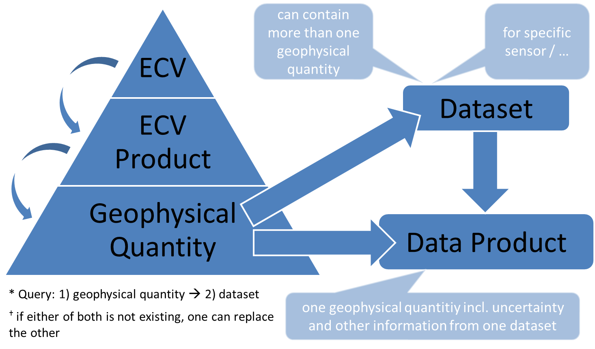

.. _[RD-9]: http://www.wmo.int/pages/prog/sat/documents/ARCH_strategy-climate-architecture-space.pdf
.. _[RD-10]: http://ceos.org/document_management/Working_Groups/WGClimate/Meetings/WGClimate-6/WGClimate_ECV-Inventory-Questionnaire-Guide_v2-2_Feb2016.pdf

===========
Terminology
===========

In order to avoid confusion and ambiguity, a common terminology was agreed on as listed in :numref:`terminologytab`. It is partially based on `[RD-9]`_ and `[RD-10]`_ and is to be used in all parts of the CCI Toolbox project from the user-sided activities to the software development. The concept regarding the naming of data is also illustrated in :numref:`terminology`.

.. list-table:: Toolbox Terminology
   :name: terminologytab
   :widths: 5 25
   :header-rows: 1
   
   * - Term
     - CCI Toolbox Definition
   * - ECV
     - Umbrella term for /U+2192\ geophysical quantity/quantities associated with climate variation and change as well as the impact of climate change onto Earth (e.g. cloud properties).
   * - ECV product
     - Subdivision of /U+2192\ ECVs in long-term data record of values or fields, covering one or more /U+2192\ geophysical quantities (e.g. Cloud Water Path).
   * - Geophysical quantity
     - One physical parameter/variable in that constitutes a time series of observations (e.g. Cloud Liquid Water Path).
   * - Dataset
     - In-memory representation of data read from a /U+2192\ data source. Contains multiple layers of a /U+2192\ geophysical quantity or multiple /U+2192\ geophysical quantities with multiple layers encompassing e.g. information on temporal and spatial dimensions and localization or uncertainty information.
   * - Data product
     - Combination of /U+2192\ dataset and /U+2192\ geophysical quantity incl. uncertainty information (e.g. Cloud Liquid Water Path from L3S Modis merged phase1 v1.0 including uncertainty, standard deviation, number of observations, …)
   * - Schema
     - Describes a /U+2192\ dataset's structure, contents and data types.
   * - Data store
     - Offers multiple /U+2192\ data sources.
   * - Data source
     - A concrete source for /U+2192\ datasets. Has a /U+2192\ schema and knows about dataset coverage. Used to load /U+2192\ datasets.

   CCI Toolbox Terminology
        
