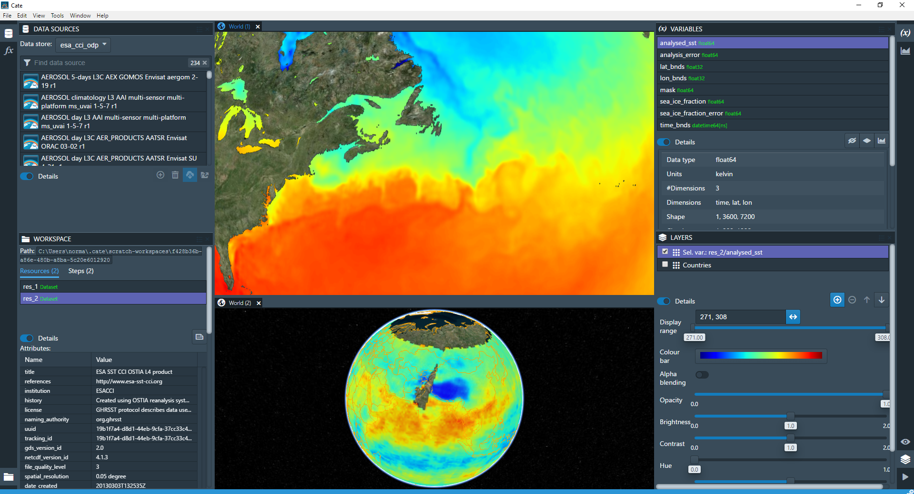
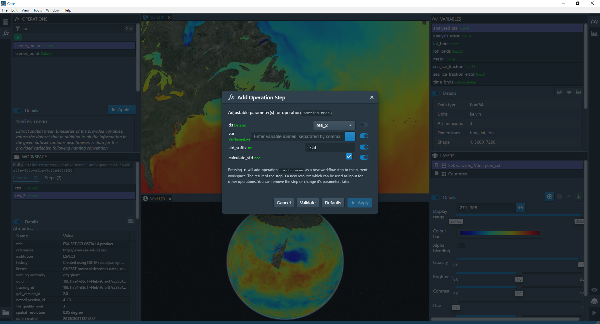

=================
Desktop Interface
=================

*Cate Desktop* is a desktop application and is intended to serve as the primary graphical user interface (GUI)
of the CCI Toolbox. Cate Desktop has no public release yet. However, it is actively developed and a first version is
expected to be released in Spring 2017.

The source code is available at GitHub in the `cate-desktop <https://github.com/CCI-Tools/cate-desktop>`_ repository.
It is quite easy to build it from scratch and run from the command-line. If you are interested, just follow the
build instructions given in the repository's `README <https://github.com/CCI-Tools/cate-desktop/blob/master/README.md>`_.

The following :numref:`cate_desktop_1` and :numref:`cate_desktop_2` are screen shots of an early development stage
(Jan 2017) of Cate Desktop:

.. _cate_desktop_1:

   Cate Desktop showing panels DATA SOURCES and LAYERS with CCI Ozone layer on a globe view

.. _cate_desktop_2:

   Cate Desktop showing the ADD WORKFLOW STEP dialog (``tseries_point`` operation)

