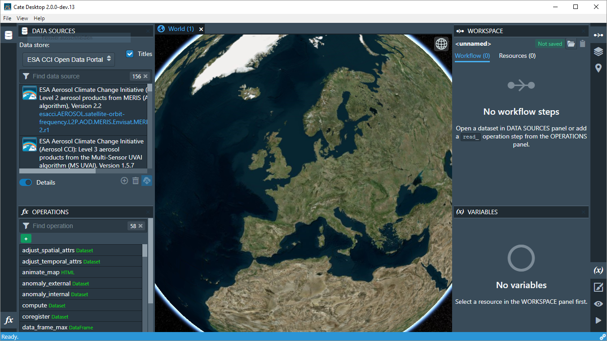
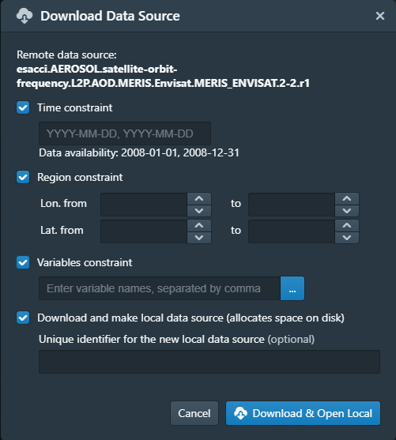
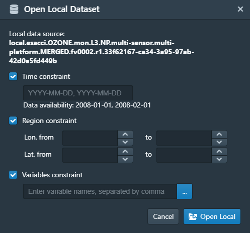
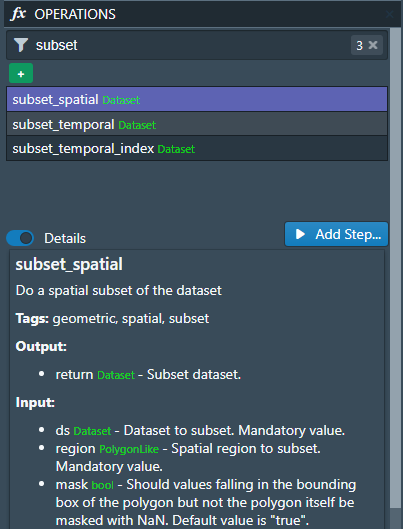

==================
Cate Desktop (GUI)
==================

*Applies to Cate Desktop, version 0.8.0*

Overview
========

*Cate Desktop* is a desktop application and is intended to serve as the primary graphical user interface (GUI)
for the CCI Toolbox.

It provides all the Cate CLI and almost all Cate Python API functionality through a interactive and user friendly
interface and adds some unique imaging and visual data analysis features.

The basic idea of Cate Desktop is to allow access all remote CCI data sources and calling all Cate operations
through a consistent interface. The results of opening a data source or applying an operations is usually
an in-memory dataset representation - this is what Cate calls a *resource*. Usually, a resource refers to
a (NetCDF/CF) dataset comprising one or more geo-physical variables, but a resource can virtually be of any (Python)
data type.

The Cate Desktop user interface basically comprises *panels*, *views*, and a *menu bar*:

.. _gui_initial:

   Cate Desktop initial layout

------
Panels
------

When run for the first time, the initial layout and position of the *panels*, as shown in :numref:`gui_initial`,
reflects what just has been described above with respect to data sources, operations, resources/datasets, and variables:

1. On the upper left, the **DATA SOURCES** panel to browse, download and open both local and remote data sources,
   including data from ESA CCI Open Data Portal;
2. On the lower left, the **OPERATIONS** panel to browse and apply available operations;
3. On the upper right, the **WORKSPACE** panel to browser and select available resources and workflow steps resulting
   from opening data sources and applying operations;
4. On the lower right, the **VARIABLES** panel to browse and select the geo-physical variables contained in the
   selected resource.

Other panels are initially hidden. They are

* On the upper left, the **LAYERS** panel, to manage the imagery layers displayed on the active *World view*;
* On the upper left, the **PLACEMARKS** panel, to manage user-defined placemarks, which may be used as input to
  various operations, e.g. to create time series plots;
* On the lower right, the **VIEWS** panel, to display and edit properties of the currently active view. It also allows
  for creating new *World views*;
* On the lower right, the **TASKS** panel, to list and possibly cancel running background tasks.

Each panel's visibility can be controlled by left- and right-most panel bars. Click on a panel icon to toggle its
visibility. Between two panels, there are invisible, horizontal split bars. Move the mouse pointer over the split bar
to see it turning into a split cursor, then drag to change the vertical split position. In a similar way, there are
invisible, vertical split bars between the tool panels and the views area. Move the mouse cursor over them to find them.

-----
Views
-----

The central area is occupied by *views* that can be arranged in rows and columns. Cate currently offers three view
types:

* The **World view**, displaying imagery data originaling from data variables and placemarks on either a
  3D globe or a 2D map;
* The **table view**, displaying tabular resource and variable data in a table;
* The **figure view**, displaying plots  from special figure resources resulting from the various plotting operations.

There may be multiple views stacked in a row of tabs, where each tab represents a view. One view within a tab row
is selected and visible. The selected view can be split horizontally or vertically by dedicated icon buttons on the
right of the tab row header. A split view can be stacked again by the drop down menu (...) on the right-most position
of the the row tab header.

There is always a single *active view* indicated by the blueish view header text. To activate a view,
click its header text. The active view provides a context for various commands, for example all interactions with
the **LAYERS** and **VIEW** panels are associated with the active view.

Initially, a single World view is opened and active.

--------
Menu Bar
--------

Cate's menu currently comprises the **File**, **View**, and **Help** menus. The **File** menu comprises
*Workspace*-related commands and allows setting user **Preferences**:

.. _gui_menu_file:

   Cate Desktop's File menu (Windows 10)

======================   ===============
Menu item                Description
======================   ===============
**New Workspace**        Creates a new *scratch* workspace. Scratch workspaces are not-yet-saved workspaces.
**Open Workspace**       Opens an existing workspace. Will open a dialog to select a workspace directory.
**Close Workspace**      Close current workspace and create a new scratch workspace.
**Save Workspace**       Save current workspace it its directory. Will delegate to **Save Workspace As** if it hasn't been saved before.
**Save Workspace As**    Opens a dialog to choose a new *empty*, directory in which the current workspace data will be saved. This will become the current workspace directory.
**Preferences**          Opens a dialog where users can adjust various settiungs according to their preferences. See also :ref:`preferences_dialog`.
**Exit** / **Quit**      Exits the application
======================   ===============

More information regarding workspaces can be found in section :ref:`about_workspaces`.

Reference
=========

.. _data_sources_panel:

------------------
DATA SOURCES Panel
------------------

.. _gui_panel_data_sources_odp:

.. figure:: ../_static/figures/user_manual/gui_panel_data_sources_odp.png
   :scale: 100 %
   :align: left

   DATA SOURCES panel for ``esa_cci_odp``

The **DATA SOURCES** panel is used to browse, download and open both local and remote data sources published by
*data stores*.

Using the drop-down list located at the top of the panel, it is possible to switch between the the currently
available data stores. At the time of writing, two data stores were available in Cate, ``esa_cci_odp`` the remote
ESA Open Data Portal, and ``local`` representing data sources made available on your local computer.
Below data stores selector, there is a search field, while typing, the list of data sources published through
the selected data store is narrowed down. Selecting a data source entry will allow displaying its **Details**,
namely the available (geo-physical) variables and the meta-data associated with the data source.

In order to start working with remote data from the ``esa_cci_odp`` data store, there are two options which are
explained in the following:

1. Download the complete remote dataset or a subset and make it a new *local* data source available from the
   ``local`` data store. Open the dataset from the new local data source. **This is currently the recommended way
   to access remote data** as local data stores ensure sufficient I/O performance and are not bound to your internet
   connection and remote service availablity.
2. Open the remote dataset without creating a local data copy. **This option should only be used for small subsets
   of the data**, e.g. time series extractions within small spatial areas, as there is currently no way to observe
   the data rate and status of data elements already transferred.
   (Internally, we use the `OPeNDAP <https://www.opendap.org/>`_ service of the ESA CCI Open Data Portal.)

After selecting a remote data source, press the **Download** button to open the *Download Dataset** dialog shown
in :ref:`gui_dialog_download_dataset` to use the first option.

.. _gui_dialog_download_dataset:

   Download Dataset dialog

Here you can specify a number of optional constraints to create a local data source that is a subset of the original
remote one. You can also provide a name for the new data source. By default, the original name will be used, prefixed
by "local".

.. note::
   Downloading remote data may require a lot of free space on your local system. By default, Cate stores this data
   in the user's home directory. On Linux and Mac OS, that is  ``~/.cate/data_stores`, on Windows it is
   ``%USER_PROFILE%\.cate\data_stores``. Use the :ref:`preferences_dialog` to set an alternative location.

After confirming the dialog, a download task will be started, which can be observed in the **TASKS** panel.
Once the download is finished, a notification will be displayed and a new local data source will be available for the
``local`` data store.

To choose the second option described above, press the **Open** button to open the **Open Remote Dataset** dialog shown
in :ref:`gui_dialog_open_remote_dataset`.

.. _gui_dialog_open_remote_dataset:

.. figure:: ../_static/figures/user_manual/gui_dialog_open_remote_dataset.png
   :scale: 100 %
   :align: center

   Open Remote Dataset dialog

It provides the same constraint settings as the former download dialog. After confirming the dialog, a task
will be started that directly streams the remote data into your computer's local memory. If the open task finishes,
a new dataset *resource* is available from the :ref:`workspace_panel`.

.. _gui_panel_data_sources_local:

.. figure:: ../_static/figures/user_manual/gui_panel_data_sources_local.png
   :scale: 100 %
   :align: left

   DATA SOURCE panel for ``local``

Switching the data store selector to ``local`` lists all currently available local data sources as shown in
:ref:`gui_panel_data_sources_local`. These are the ones downloaded from remote sources, or ones that you can
create from local data files.

Press the **Add** button to open the **Add Local Data Source** dialog that is used to create a new local data source.
A data source may be composed of one or more data files that can be stacked together along their *time dimension*
to form a single unique multi-file dataset. At the time of writing, only NetCDF (``*.nc``) data sources are supported.

Pressing the **Open** button will bring up the **Open Local Dataset** dialog as
shown in the :ref:`gui_dialog_open_local_dataset` below:

.. _gui_dialog_open_local_dataset:

   Open Local Dataset dialog

Confirming the dialog will create a new in-memory dataset *resource* which will be available from the
:ref:`workspace_panel`.

Note, that **Cate will load into memory only those slices of a dataset, which are required to
perform some action**. For example, to display an image layer on the 3D Globe view, Cate only loads the 2D image for
a given time index, although the dataset might be composed of multiple such 2D images that form a time series and / or
a stack of atmospheric layers.

.. _operations_panel:

----------------
OPERATIONS Panel
----------------

.. _gui_panel_operations:

   OPERATIONS panel

The **OPERATIONS** panel is used to browse and apply available operations.
The term *operations* as used in the Cate context includes functions that

* read datasets from files;
* manipulate these dataset;
* plot datasets;
* write datasets to files.

Note that all Cate operations are plain Python functions. To let them appear in Cate's GUI and CLI,
the are annotated with additional meta-information. This also allows for setting specific operation input/output
properties so that specific user interfaces for a given operation is genereted on-the-fly.
If you are a Python programmer, you might be interested to take a look at the various operation implementations
in the `cate.ops <https://github.com/CCI-Tools/cate-core/tree/master/cate/ops>`_ sub-package. They all use
Python 3.5 *type annotations* and Cate *decorators* ``@op``, ``@op_input``, ``@op_output`` to add
that meta-information to a function and to publish it to the GUI and CLI.

.. note::
   Some operations allow or require entering a path to a file or a directory location. When you pass a relative path,
   it is meant to be relative to the current workspace directory.

.. _workspace_panel:

---------------
WORKSPACE Panel
---------------

.. _variables_panel:

---------------
VARIABLES Panel
---------------

.. _layers_panel:

------------
LAYERS Panel
------------

.. _placemarks_panel:

----------------
PLACEMARKS Panel
----------------

.. _views_panel:

-----------
VIEWS Panel
-----------

.. _tasks_panel:

-----------
TASKS Panel
-----------

.. _preferences_dialog:

------------------
Preferences Dialog
------------------

