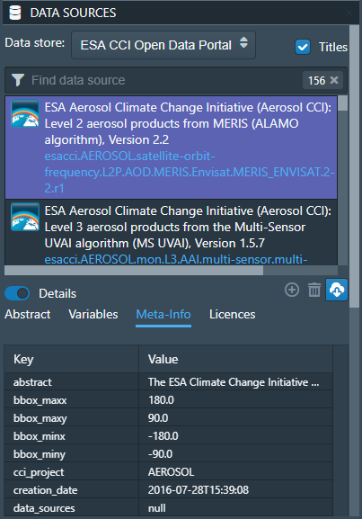
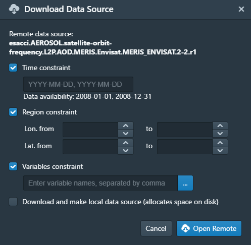
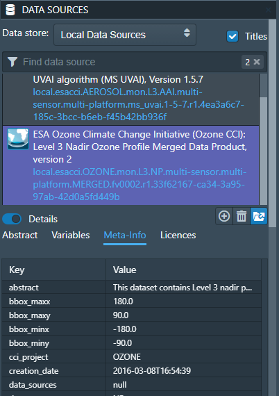
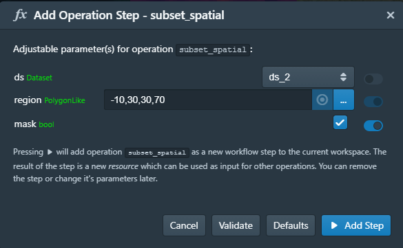
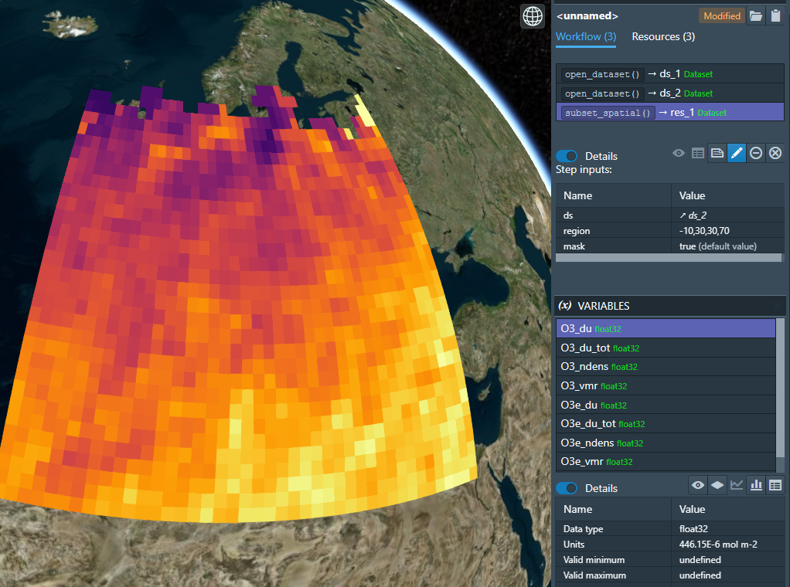
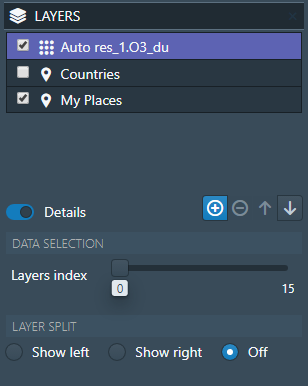
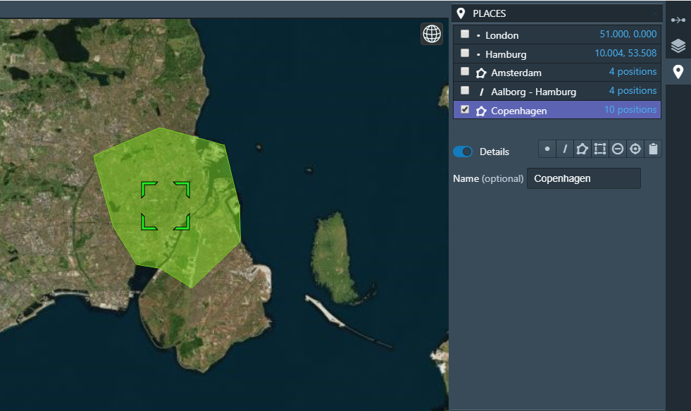
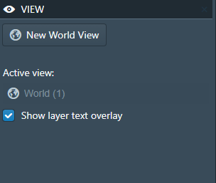
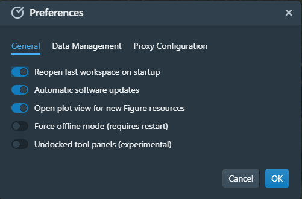

==================
Cate Desktop (GUI)
==================

*Applies to Cate Desktop, version 2.0.0-dev14*

Overview
========

*Cate Desktop* is a desktop application and is intended to serve as the primary graphical user interface (GUI)
for the CCI Toolbox.

It provides all the Cate CLI and almost all Cate Python API functionality through a interactive and user friendly
interface and adds some unique imaging and visual data analysis features.

The basic idea of Cate Desktop is to allow access all remote CCI data sources and calling all Cate operations
through a consistent interface. The results of opening a data source or applying an operations is usually
an in-memory dataset representation - this is what Cate calls a *resource*. Usually, a resource refers to
a (NetCDF/CF) dataset comprising one or more geo-physical variables, but a resource can virtually be of any (Python)
data type.

The Cate Desktop user interface basically comprises *panels*, *views*, and a *menu bar*:

.. _gui_initial:

.. figure:: ../_static/figures/user_manual/gui_initial.png
   :width: 1024px
   :align: center

   Cate Desktop initial layout

------
Panels
------

When run for the first time, the initial layout and position of the *panels*, as shown in :numref:`gui_initial`,
reflects what just has been described above with respect to data sources, operations, resources/datasets, and variables:

1. On the upper left, the **DATA SOURCES** panel to browse, download and open both local and remote data sources,
   including data from ESA CCI Open Data Portal;
2. On the lower left, the **OPERATIONS** panel to browse and apply available operations;
3. On the upper right, the **WORKSPACE** panel to browser and select available resources and workflow steps resulting
   from opening data sources and applying operations;
4. On the lower right, the **VARIABLES** panel to browse and select the geo-physical variables contained in the
   selected resource.

Other panels are initially hidden. They are

* On the upper right, the **LAYERS** panel, to manage the imagery layers displayed on the active *World view*;
* On the upper right, the **PLACEMARKS** panel, to manage user-defined placemarks, which may be used as input to
  various operations, e.g. to create time series plots;
* On the lower right, the **STYLES** panel, to adjust the styles of the selected layer or entity;
* On the lower right, the **VIEWS** panel, to display and edit properties of the currently active view. It also allows
  for creating new *World views*;
* On the lower right, the **TASKS** panel, to list and possibly cancel running background tasks.

Each panel's visibility can be controlled by left- and right-most panel bars. Click on a panel icon to toggle its
visibility. Between two panels, there are invisible, horizontal split bars. Move the mouse pointer over the split bar
to see it turning into a split cursor, then drag to change the vertical split position. In a similar way, there are
invisible, vertical split bars between the tool panels and the views area. Move the mouse cursor over them to find them.

-----
Views
-----

The central area is occupied by *views* that can be arranged in rows and columns. Cate currently offers three view
types:

* The **world view**, displaying imagery data originaling from data variables and placemarks on either a
  3D globe or a 2D map;
* The **table view**, displaying tabular resource and variable data in a table;
* The **figure view**, displaying plots  from special figure resources resulting from the various plotting operations.

There may be multiple views stacked in a row of tabs, where each tab represents a view. One view within a tab row
is selected and visible. The selected view can be split horizontally or vertically by dedicated icon buttons on the
right of the tab row header. A split view can be stacked again by the drop down menu (...) on the right-most position
of the the row tab header.

There is always a single *active view* indicated by the blueish view header text. To activate a view,
click its header text. The active view provides a context for various commands, for example all interactions with
the **LAYERS** and **VIEW** panels are associated with the active view.

Initially, a single World view is opened and active.

--------
Menu Bar
--------

Cate's menu currently comprises the **File**, **View**, and **Help** menus. The **File** menu comprises
*Workspace*-related commands and allows setting user **Preferences**:

.. _gui_menu_file:

.. figure:: ../_static/figures/user_manual/gui_menu_file.png
   :scale: 100 %
   :align: center

   Cate Desktop's File menu (Windows 10)

======================   ===============
Menu item                Description
======================   ===============
**New Workspace**        Creates a new *scratch* workspace. Scratch workspaces are not-yet-saved workspaces.
**Open Workspace**       Opens an existing workspace. Will open a dialog to select a workspace directory.
**Close Workspace**      Close current workspace and create a new scratch workspace.
**Save Workspace**       Save current workspace it its directory. Will delegate to **Save Workspace As** if it hasn't been saved before.
**Save Workspace As**    Opens a dialog to choose a new *empty*, directory in which the current workspace data will be saved. This will become the current workspace directory.
**Preferences**          Opens a dialog where users can adjust various settiungs according to their preferences. See also :ref:`preferences_dialog`.
**Exit** / **Quit**      Exits the application
======================   ===============

More information regarding workspaces can be found in section :ref:`about_workspaces`.

Reference
=========

-----
Index
-----

* :ref:`data_sources_panel`
* :ref:`operations_panel`
* :ref:`workspace_panel`
* :ref:`variables_panel`
* :ref:`placemarks_panel`
* :ref:`layers_panel`
* :ref:`styles_panel`
* :ref:`view_panel`
* :ref:`tasks_panel`
* :ref:`preferences_dialog`

.. _data_sources_panel:

------------------
DATA SOURCES Panel
------------------

.. _gui_panel_data_sources_odp:

   Data Sources panel for ``ESA CCI Open Data Portal``

The **DATA SOURCES** panel is used to browse, download and open both local and remote data sources published by
*data stores*.

Using the drop-down list located at the top of the panel, it is possible to switch between the the currently
available data stores. At the time of writing, two data stores were available in Cate, the remote
*ESA Open Data Portal*, and *Local Data Sources* representing datasets made available through your file system.
Below data stores selector, there is a search field, while typing, the list of data sources published through
the selected data store is narrowed down. Selecting a data source entry will allow displaying its **Details**,
namely the available (geo-physical) variables and the meta-data associated with the data source.

In order to start working with remote data from the *ESA CCI Open Data Portal* data store, there are two options which are
explained in the following:

1. Download the complete remote dataset or a subset and make it a new *local* data source available from the
   local data store. Open the dataset from the new local data source. **This is currently the recommended way
   to access remote data** as local data stores ensure sufficient I/O performance and are not bound to your internet
   connection and remote service availability.
2. Open the remote dataset without creating a local data copy. **This option should only be used for small subsets
   of the data**, e.g. time series extractions within small spatial areas, as there is currently no way to observe
   the data rate and status of data elements already transferred.
   (Internally, we use the `OPeNDAP <https://www.opendap.org/>`_ service of the ESA CCI Open Data Portal.)

After selecting a remote data source, press the **Download** button to open the *Download Dataset** dialog shown
in :numref:`gui_dialog_download_dataset` to use the first option.

.. _gui_dialog_download_dataset:

.. figure:: ../_static/figures/user_manual/gui_dialog_download_dataset.png
   :scale: 100 %
   :align: center

   Download Dataset dialog

Here you can specify a number of optional constraints to create a local data source that is a subset of the original
remote one. You can also provide a name for the new data source. By default, the original name will be used, prefixed
by ``local.``.

.. note::
   We strongly recommend to set the constraints to limit the overall amount of data to be downloaded
   and stored. We are currently not able to pre-compute the amount of data and the time it will take to
   fully download it.
   Also note, that downloading remote data may require a lot of free space on your local system.
   By default, Cate stores this data in the user's home directory. On Linux and Mac OS, that is
   ``~/.cate/data_stores``, on Windows it is
   ``%USER_PROFILE%\.cate\data_stores``.
   Use the :ref:`preferences_dialog` to set an alternative location.

After confirming the dialog, a download task will be started, which can be observed in the **TASKS** panel.
Once the download is finished, a notification will be displayed and a new local data source will be available for the
``local data store``.

To choose the second option described above, press the **Download** button to open the **Download Dataset** dialog, and
then uncheck **Download and make local data source (allocates space on disk)** as shown in
:ref:`gui_dialog_open_remote_dataset`.

.. _gui_dialog_open_remote_dataset:

   Open Remote Dataset dialog

It provides the same constraint settings as the former download dialog. After confirming the dialog, a task
will be started that directly streams the remote data into your computer's local memory. If the open task finishes,
a new dataset *resource* is available from the :ref:`workspace_panel`.

.. _gui_panel_data_sources_local:

   Data Sources panel for ``local``

Switching the data store selector to *Local Data Sources* lists all currently available local data sources as shown in
:numref:`gui_panel_data_sources_local`. These are the ones downloaded from remote sources, or ones that you can
create from local data files.

Press the **Add** button to open the **Add Local Data Source** dialog that is used to create a new local data source.
A data source may be composed of one or more data files that can be stacked together along their *time dimension*
to form a single unique multi-file dataset. At the time of writing, only NetCDF (``*.nc``) data sources are supported.

Pressing the **Open** button will bring up the **Open Local Dataset** dialog as
shown in :numref:`gui_dialog_open_local_dataset` below:

.. _gui_dialog_open_local_dataset:

.. figure:: ../_static/figures/user_manual/gui_dialog_open_local_dataset.png
   :scale: 100 %
   :align: center

   Open Local Dataset dialog

Confirming the dialog will create a new in-memory dataset *resource* which will be available from the **WORKSPACE**
panel as shown in :numref:`gui_panel_workspace_res`.

Note, that **Cate will load into memory only those slices of a dataset, which are required to
perform some action**. For example, to display an image layer on the 3D Globe view, Cate only loads the 2D image for
a given time index, although the dataset might be composed of multiple such 2D images that form a time series and / or
a stack of atmospheric layers.

.. _operations_panel:

----------------
OPERATIONS Panel
----------------

The **OPERATIONS** panel is used to browse and apply available operations. The term *operations* as used
in the Cate context includes functions that

* read datasets from files;
* manipulate these dataset;
* plot datasets;
* write datasets to files.

The **Details** section provides a description about the operation including its inputs and outputs.

.. note::
   To programmers: At the time of writing, all Cate operations are plain Python functions.
   To let them appear in Cate's GUI and CLI, they are annotated with additional meta-information.
   This also allows for setting specific operation input/output
   properties so that specific user interfaces for a given operation is genereted on-the-fly.
   You might be interested to take a look at the various functions in the modules of
   the `cate.ops <https://github.com/CCI-Tools/cate/tree/master/cate/ops>`_ Python package of Cate.
   These functions all use Python 3.5 *type annotations* and Cate *decorators* ``@op``, ``@op_input``,
   ``@op_output`` to add that meta-information to turn it into Cate *operations*.

.. _gui_panel_operations:

.. figure:: ../_static/figures/user_manual/gui_panel_operations.png
   :scale: 100 %
   :align: left

   Operations panel

Pressing the **Apply...** button will bring up a dialog that let's you enter the operation's parameter
values. For most parameter types (numeric, boolean, text), an input field is provided. For the ones that don't have
a dedicated input field, a *resource selector* is provided that let's you select a *resource* from a drop-down list.
Only resources are listed whose data type match the required parameter type.
Most commonly, these will be resources of type

* ``Dataset``: N-dimensional, gridded data as originating from NetCDF file sets or OPeNDAP services
* ``DataFrame``: two-dimensional, tabular data from CSV files
* ``GeoDataFrame``: similar to ``DataFrame`` but include geometry data and are originating from
  ESRI Shapefiles and GeoJSON services.

Note that every parameter value can be set to a resource by checking the switch to right of the parameter field.
This will exchange the input field by a resource selector.

.. _gui_dialog_new_op_step:

   New Operation Step dialog

After pressing the **Apply** button, the operation is being invoked and a new *workflow step*
will be added to the workspace. For any operations returning a value a new *resource* will be added as well.

The new *workflow step* and the new *resource*, if any, are shown in the **WORKSPACE** panel.

.. _gui_dialog_new_op_step_applied:

   New Operation Step in WORKSPACE Panel

.. note::
   Some operations allow or require entering a path to a file or a directory location. When you pass a relative path,
   it is meant to be relative to the current workspace directory.

.. _workspace_panel:

---------------
WORKSPACE Panel
---------------

The **WORKSPACE** panel is used to manage the current Cate workspace whose name is displayed
in the header line of the panel. To the right of the workspace name there is an indicator whether the
workspace is modified or not.

In the upper left of the panel are two tools buttons that allow for
* opening the workspace directory in your operating system's file explorer;
* copying the workspace workflow into the operating system's clipboard as Python script, shell script or in JSON format.

The *workflow steps* and *resources* of the current workflow are shown in the
respective **Workflow** and **Resources** sub-panels.

Workspace / Workflow Panel
--------------------------

This panel lists all the workflow steps originating from opening datasets and applying operations in chronological
order. The **Details** section displays the used parameter values of a selected workflow step.

.. _gui_panel_workspace_steps:

.. figure:: ../_static/figures/user_manual/gui_panel_workspace_steps.png
   :scale: 100 %
   :align: left

   Workspace / Workflow panel

Workspace / Resources Panel
---------------------------

This panel lists all the data resources originating from workflow steps. The **Details** section displays the
properties and metadata of the selected data resource.

A data resource may contain any number of *data variables*. This is usually the case for any resource of type
``Dataset`` or ``DataFrame``. The contained variables of a selected data resource are shown in the **VARIABLES** panel.

.. _gui_panel_workspace_res:

.. figure:: ../_static/figures/user_manual/gui_panel_workspace_res.png
   :scale: 100 %
   :align: right

   Workspace / Resources panel

The toolbar to the lower right of the list of workflow steps or resources offers the following functions (in order):

* Show figure. Shows the associated data **resource in a figure view**.
  Only enabled if the resource is of type ``Figure`` which is the is for example
  the case for the various ``plot_<type>()`` operations.
* Show table: Shows the associated data **resource in a table view** if it is two-dimensional data.
* Edit resource / workflow step properties: Brings up a dialog which lets you **rename a resource** and
  **make a resource persistent** within the workspace. The latter can drastically speed up workspace loading
  especially for data resources that are expensive to recompute.
* **Edit operation parameters** of a selected workflow step or resource: Brings up a the **Edit Operation Step**
  dialog similar to the
  :ref:`gui_dialog_new_op_step`. Confirming the dialog by pressing **Apply** will invoke workflow step
  and compute a new resource value. All workflow step that depend on this resource will also
  be executed again possibly triggering other workflow step executions.
* **Remove** a selected workflow step or resource. Removal will fail if other steps depend on it.
* **Clean** the current workspace which will remove all steps and resources.

.. _variables_panel:

---------------
VARIABLES Panel
---------------

The **VARIABLES** panel lists the data variables of a selected resource in the **WORKSPACE** panel.
The list entry shows the variable's name and its data type. When available, the value of each variable of the selected
layer will be displayed next to its name after placing the mouse cursor at a point on the globe for ~600ms.

The toolbar to the lower right of the list of variables offers the following functions (in order):

* **Toggle layer visibility**: if the variable can be displayed as an image layer in the 3D globe view.
* **Add new image layer**: adds the selected variable as an image layer to the active world view, if any.
* **Create time series plot** from selected placemark. Adds a new workflow step which calls the ``plot()`` operation.
* **Create histogram plot**. Adds a new workflow step which calls the ``plot_hist()`` operation.
* **Show data in table view**. Displays 2D variables of type ``DataFrame`` in a table view.

.. _gui_panel_variables:

.. figure:: ../_static/figures/user_manual/gui_panel_variables.png
   :scale: 100 %
   :align: right

   Variables panel

.. _layers_panel:

------------
LAYERS Panel
------------

This panel manages the list of visual layers displayed by the currently active 2D map or 3D world view.
Any number of layers can be added to active view. Two are always available:

* Selected Variable
* Country Borders

The layer *Selected Variable* displays the data of any selected variable in the **VARIABLES** panel
if it is gridded and has at least the longitude and latitude dimensions (names ``lon`` and ``lat``).
The toolbar to the lower right of the layer list offers the following functions (in order):

* Add a new layer (currently you can add layers for other variables available in your workspace)
* Remove the selected layer
* Move selected layer up to render it on top of others
* Move selected layer down so other layers are rendered on top of it

The **Details** of the **LAYERS** panel lists several layer settings:

* *Data selection* with this configuration one can quickly browse through the dataset based on the layer index.
* *Layer split* with this setting, user can create a split line with one side of the line showing the globe with
  the selected layer and the other side showing only the globe.

   Layers Panel

.. _placemarks_panel:

----------------
PLACEMARKS Panel
----------------

This panel manages a list of placemarks - points, lines, polygons, or boxes that have a name and a geographical coordinate.
Placemarks can be used to create time series plots and to extract data at a given point or area. The toolbar
to the lower right of the list of placemarks offers the following functions (in order):

* Add a new marker
* Add a new polyline
* Add a new polygon
* Add a new box
* Remove a selected placemark
* Locate the selected placemark on the map
* Copy name and/or coordinates of selected placemark to clipboard

In addition to these buttons, there is also a Details toggle button to display or allow modification of the selected
placemark. What can be modified depends on which type of placemark is selected.

To add a new marker, click **New marker** button (the left-most), and then click any point on the Globe. A new entry is
added to the list of placemarks in Placemarks Panel. When the Details toggle is enabled, you can modify the
name and coordinates (in longitude and latitude) of this marker.

   Placemarks Panel - Marker details

To add a new polyline, click **New polyline** button (the second left-most). Click a point in the Globe to start the
line, and then click the next n-lines as you wish. To finish, double-click at your final point. When the Details toggle
is enabled, you can modify the name of this polyline.

   Placemarks Panel - Polyline details

To add a new polygon, click the **New polygon** button (the third left-most). As when creating a polyline, click a
point in the Globe to start the line, and then click the next n-lines as you wish. To finish, double-click at your final
point.  When the Details toggle is enabled, you can modify the name of this polygon.

   Placemarks Panel - Polygon details

To add a new polygon, click the **New box** button (the fourth left-most). To start, click a point in the Globe.
This will be one of the vertices of the box you are going to create. Drag it to satisfy the region you desire, and click
once more to confirm the box selection.  When the Details toggle is enabled, you can modify the name of this box.

   Placemarks Panel - Box details

The list of placemarks is currently stored as a GeoJSON entry in ``.cate/preferences.json`` in the users home directory
and restored for every Cate Desktop session.

To copy the selected placemark to clipboard, click the right-most button. There are three options how the selected
placemark can be represented in three different formats: CSV, WKT, and GeoJSON.

.. figure:: ../_static/figures/user_manual/gui_panel_placemarks_copy.png
   :scale: 100 %
   :align: center

   Placemarks Panel - Copy to clipboards

.. _styles_panel:

------------
STYLES Panel
------------

This panel manages styles that can be applied to the selected layer. It has two different modesdepending on whether an
image or a vector layer is selected. Here are the available settings for a vector layer:

* *Fill* controls the fill colour and the opacity of a polygon or a box.
* *Stroke* controls the width, colour, and opacity of the lines surrounding the polygon or the box.
* *Marker* controls the colour, size, and caption of the placemark. The symbol can be either a single digit of number,
  a letter, or any valid **Maki** identifier (more information `here <https://www.mapbox.com/maki-icons/>`_)

.. figure:: ../_static/figures/user_manual/gui_panel_styles_placemark.png
   :width: 1024px
   :align: center

   Styles Panel for styling a placemark

   Styles Panel for styling a polygon/box

And here are the available settings for an image layer:

* *Display Range* is the value range to which a given colour map is mapped.
* *Colour bar* is applied to gridded variables.
* *Alpha Blending* is used to mask/fade out the lower half of the display range.
  With *Alpha Blending* switched on, the minimum value of the display range corresponds to full transparency while
  opacity increases until half of the display range is reached.
* For any extra dimension of a variable that is not latitude and longitude, an *Index into <Dimension>* slider is
  displayed and can be used to selected the dimension's index to be displayed as layer.
* The *Opacity* controls the opacity of the selected layer
* Various *Image Enhancement* settings, like *Brightness*, * Contrast*, *Hue*.

.. _view_panel:

----------
VIEW Panel
----------

The **VIEW** panel shows the settings of the currently active *View*. The settings depend non the type of the active
view.

*World Views* have the following settings:

* Whether to use a 2D map or 3D globe.
* The projection for the 2D map.
* Whether to show layer titles (currently 3D globe only).
* Whether to split the current layer (currently 3D globe only).

*Figures Views* don't provide any special settings yet. However, in future releases, you will be able to
change plot styles and size.

*Table Views* also don't provide any special settings yet. However, in future releases, you will be able to specify
the subset of the data ypou want to see in the table.

   View Panel

.. _tasks_panel:

-----------
TASKS Panel
-----------

The **TASKS** panel shows all active tasks. Long running tasks are usually originating
from downloading datasets or performing operations on datasets. Some running
tasks may be cancelled, others not.

.. figure:: ../_static/figures/user_manual/gui_panel_tasks.png
   :scale: 100 %
   :align: center

   Tasks Panel

.. _preferences_dialog:

------------------
Preferences Dialog
------------------

On the **General** tab you can specify the following settings:

* Whether to *reopen the last workspace on startup* of Cate
* Whether to automatically update the software once a newer version is available
* Whether to *open a plot view for new Figure resources*. If selected and
  a newly created resource is of type ``Figure``, a plot view will be opened automatically.
  Note, ``Figure`` resources are created by operations named ``plot_<type>()``.
* Whether to *force offline mode* after restart. In this mode Cate does not rely on an internet connection.
  Therefore the background satellite imagery used for the 2D/3D maps falls back to a static, low resolution
  map.

   Preferences Dialog / General

On the **Data Management** tab you can specify the following settings:

* The location of the *synchronisation directory for remote data store files*. This
  directory is used by Cate for downloading and synchronizing remote data.
  The location shall ensure sufficient disk space for your type of application and the amount
  of data required locally.
* Whether to use a *per-workspace imagery cache* which may speed up image display performance.
  The cache is placed in each workspace directory and requires extra (disk) space.
* The *resource name prefix* which will be used by default for new resources
  originating from opening datasets or executing operations.

   Preferences Dialog / Data Management

On the **Proxy Configuration** tab you can specify the proxy URL if required.

   Preferences Dialog / Proxy Configuration

