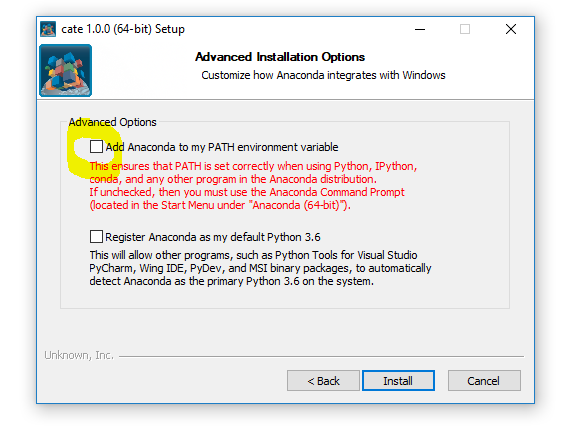

============
Installation
============

Using the Installers
====================

Installers for the Linux, Mac OS X, and Windows platform can be downloaded from the project's
`release page <https://github.com/CCI-Tools/cate-core/releases>`_ on GitHub.

The installers are self-contained, so there is no need to install additional software to run the
CCI Toolbox.

The CCI Toolbox installers for all platforms are currently
customized `Anaconda <https://www.continuum.io/why-anaconda>`_ installers. In the following we provide some notes
regarding its usage on Windows and Unix/Darwin systems.

Windows Installer
-----------------

When you run the installer on Windows, make sure you un-check **Add Anaconda to my PATH environment variable**.
Otherwise the Anaconda Python distribution used by the CCI Toolbox would become your system's default Python.

Linux/Darwin Installers
-----------------------

On Linux/Darwin systems, the downloaded installer is a shell script. To run it, open a terminal window,
``cd`` into the directory where you've downloaded the installer and execute the shell script.

.. code-block:: console

    $ cd ~/Downloads
    $ ./cate-0.6.0-Linux-x86_64.sh

If the installer script is not yet executable, type:

.. code-block:: console

    $ chmod +x cate-0.6.0-Linux-x86_64.sh

By default, the installer will install the CCI Toolbox into ``~/cate``. If you want it in another location, use the
``-p`` (=prefix) option, e.g.

.. code-block:: console

    $ ./cate-0.6.0-Linux-x86_64.sh -p cci-toolbox

Use the ``-h`` option to display other install options.

Installing from Sources
=======================

If you are a developer you may wish to build and install the CCI Toolbox from Python sources.
In this case, please follow the instructions given in the project's
`README <https://github.com/CCI-Tools/cate-core/blob/master/README.md>`_ on GitHub.

