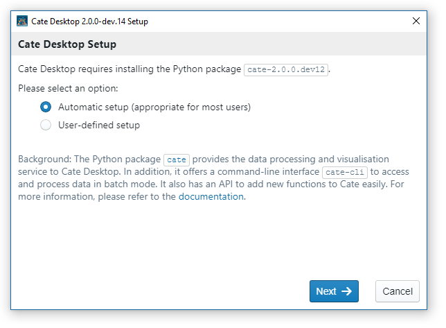
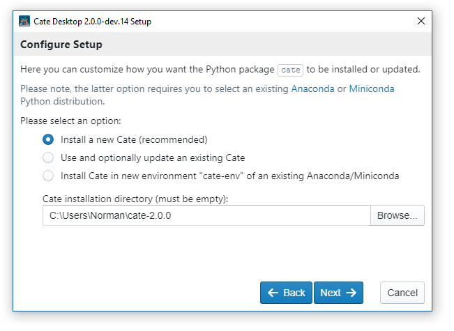
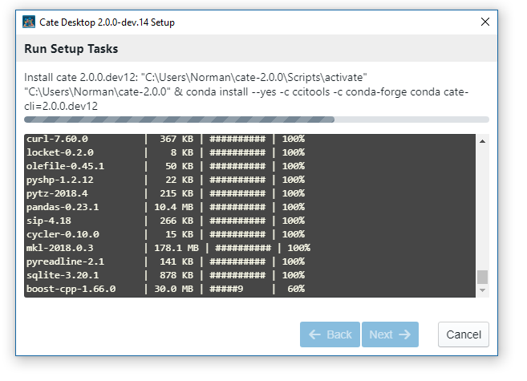
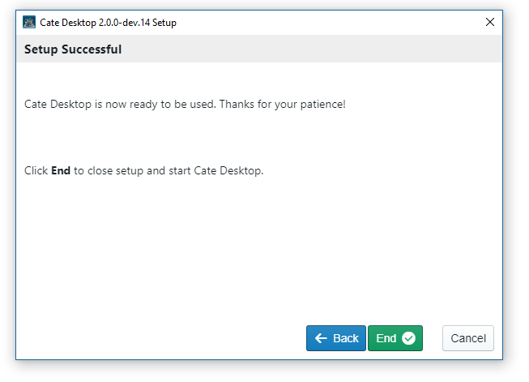

=====
Setup
=====

Cate at its core is a Python package that provides Cate's command-line interface (CLI) and
application programming interface (API). In addition, the Python package provides a visualisation and
processing service for *Cate Desktop*, Cate's graphical user interface (GUI).

For *Cate Desktop*, we provide an installer for the Windows, Mac OS X, and Linux operating systems.
The Cate Desktop installer will also ensure the Cate Python package is installed. If it can't find an existing
or compatible Cate Python package, it will install a new or update an existing one.

If you only want the Cate CLI or API, you can install just the Python package into a dedicated
`Miniconda <https://conda.io/miniconda.html>`_ or `Anaconda <https://www.anaconda.com/download/>`_ Python 3
environment. In this case, please read :ref:`setup_install_cate`.

System Requirements
===================

**Hardware**: It is recommended to use an up-to-date computer, with at least 8GB of RAM and a multi-core CPU.
The most important bottlenecks will first be the data transfer rate from local data caches into the
executing program, so it is advised to use fast solid state disks. Secondly, the internet connection
speed matters, because Cate will frequently have to download data from remote services
in order to cache it locally.

**Operating Systems**: Cate is supposed to work on up-to-date Windows, Mac OS X, and Linux operating systems.

.. _setup_install_cate_desktop:

Installing Cate Desktop (GUI)
=============================

First time installs
-------------------

The Cate Desktop installer for your platform is available from the `Cate website <https://climatetoolbox.io/>`_.

Should the website be unavailable, you can get the installer directly from
the `releases page <https://github.com/CCI-Tools/cate-desktop/releases>`_ in Cate Desktop's GitHub repository:

* ``cate-desktop-2.x.y.dmg`` and for OS X;
* ``cate-desktop-2.x.y-x86_64.AppImage`` for Linux;
* ``cate-desktop-setup-2.x.y.exe`` for Windows.

All Cate Desktop installers are quite light-weight and executed by double clicking them.

They don't require any extra user input up to the point where no existing or compatible Cate Python package is found.
In this case, Cate's *Setup process* is run:

   Setup dialog - start screen

You can just click **Next** button to use *Automatic setup* with default settings.
To see what these settings are, you could select **User-defined setup** and press **Next** in which case the
default settings are shown:

   Setup dialog - user defined settings

Pressing **Next** will perform the following setup steps for a new Cate Python package:

1. Downloading a Miniconda installer;
2. Running the Miniconda in installer in the background to install a dedicated Python environment;
3. Installing the Python conda package ``cate-cli`` into that environment.

For an existing, outdated Cate Python package it will just update it to the required version and also update all
required 3rd-party Python packages.

   Setup dialog - setup in progress

After successful installation, press **End** to start Cate Desktop:

   Setup dialog - setup successful

Should you encounter any problems with the setup, please consider filing an error report in the
`Cate issue tracker <https://github.com/CCI-Tools/cate/issues>`_.

Updating
--------

By default, Cate Desktop is supposed to keep itself up-to-date automatically. Once the update is installed,
Cate Desktop might detect an outdated Cate Python package. In this case the *Setup process*
described above is run again to update the Python package to the required version.

In case the update procedure fails,
uninstall Cate Desktop, then `download the latest version <https://github.com/CCI-Tools/cate-desktop/releases>`_
for your operating system and install again.

The auto-update feature of Cate Desktop can be disabled in the **Preferences**:

.. figure:: ../_static/figures/user_manual/gui_dialog_preferences.png
   :scale: 100 %
   :align: center

   Preferences Dialog / General

.. _setup_install_cate:

Installing Cate (CLI, API)
==========================

First time installs
-------------------

The Cate Python package requires a *Conda environment* for Python 3.6+ either provided by a
`Miniconda <https://conda.io/miniconda.html>`_ or `Anaconda <https://www.anaconda.com/download/>`_ installation.

If you haven't yet installed either of the two, we recommend you install Miniconda for Python 3 first.

With Miniconda/Anaconda installed and accessible (installation path should be on ``PATH`` environment variable)
open a shell / terminal window (Windows users type "cmd" in search field of start menu).

The steps are:

    1. create a dedicate Python environment for Cate so it doesn't interfere with other Python packages you
       might already have installed;
    2. activate that newly create Python environment for Cate;
    3. install the Cate Python package;
    4. test the installation by invoking the Cate command-line interface.

Mac OS / Linux:

.. code-block:: console

    $ conda env create -n cate-env
    $ source activate cate-env
    $ conda install -c conda-forge -c ccitools cate-cli
    $ cate --help

Windows:

.. code-block:: console

    > conda env create -n cate-env
    > activate cate-env
    > conda install -c conda-forge -c ccitools cate-cli
    > cate --help

Updating
--------

You can easily update an existing Cate installation using the ``cate upd`` command:

.. code-block:: console

    $ cate upd

Or you use Conda to install the latest version:

.. code-block:: console

    $ conda update -c conda-forge -c ccitools cate-cli

Installing from Sources
=======================

If you are a developer you may wish to build and install Cate from Python sources.
In this case, please follow the instructions given in the
`Cate README <https://github.com/CCI-Tools/cate/blob/master/README.md>`_ on GitHub.

After building and installing the Cate Python package from sources you can build an run
Cate Desktop from sources by following the instructions given in the
`Cate Desktop README <https://github.com/CCI-Tools/cate-desktop/blob/master/README.md>`_ on GitHub.
