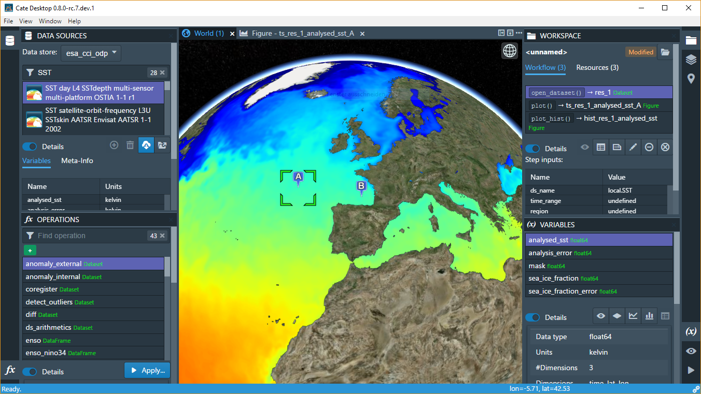
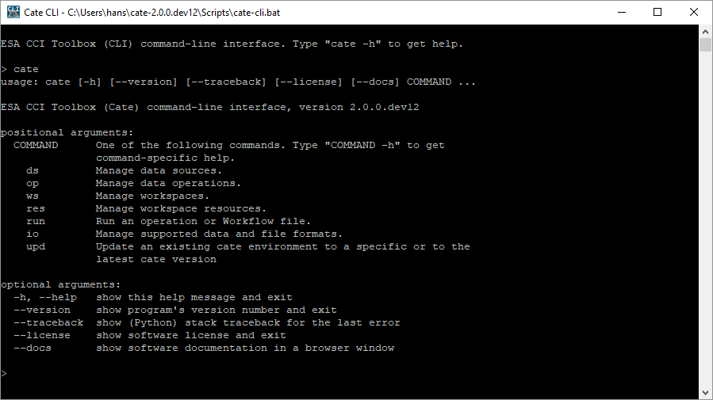
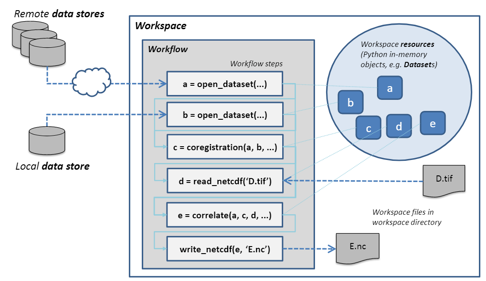

.. _Climate Change Initiative: http://cci.esa.int/objective
.. _CCI Open Data Portal: http://cci.esa.int/
.. _xarray: http://xarray.pydata.org/en/stable/
.. _pandas: http://pandas.pydata.org/
.. _geopandas: http://geopandas.org/
.. _NumPy: http://www.numpy.org/
.. _JASMINE: http://www.jasmine.ac.uk/

==========
About Cate
==========

The name *Cate* stands for "Climate Analysis Toolbox for ESA" and is a software developed to facilitate
processing and analysis of all the data products generated by the ESA `Climate Change Initiative`_ Programme (CCI). Cate
supports analysis and interactive visualisation of these data products using its software interfaces.

Interfaces
==========

Cate comprises four major software interfaces:

1. **Cate Software-as-a-Service**  provides Cate as Software-as-a-Service (SaaS). It is the recommended way to use Cate
   for the most users. It gives users access to Cate and computational resources without a burden of installation and
   configuration.

.. warning::
   Cate SaaS is still an experimental feature. A demo can be accesed at: https://cate-webui.192.171.139.57.xip.io/.
   An interested user needs to register to gain access.

2. **Cate Desktop** is a cross-platform desktop application for users who wish to use Cate predominantly with their
   local data sources. The application can also connect to the remote Cate services of Cate SaaS.

   The GUI ( desktop or web browser) of the CCI Toolbox

3. The Cate **Command-Line Interface** (CLI) from a local Cate installation can be used to access and process data
   through a command shell or console terminal. Almost all of Cate functionality except interactive visualization is
   accessible through its CLI when installed locally. The CLI can be used by users who wish to use Cate to process and
   analyze data, but use their own preferred software for further analysis and visualization. The CLI can also produce
   static plots as supported by commonly used `matplotlib`. This CLI is also suited for batch processing scripts for
   automation.

   Cate CLI, this is the CLI of the CCI Toolbox

4. The Cate **Python API** allows using Cate functions in Python programs and may also be used to extend Cate. Cate is
   programmed in Python 3.

These interfaces are further described in :doc:`user_manual`.

Concepts
========

The Cate software is based on a few simple concepts, which are referred to in all user interfaces. Therefore
you should make yourself familiar with them before using Cate.

Data Stores
-----------

By default, Cate uses the `CCI Open Data Portal`_ (ODP) **remote data store** which provides access to all published
CCI datasets. There is also a **local data store**, which is used to synchronise remote data or to add any other
data sources to Cate [1]_.

Data Sources
------------

A data store comprises multiple **data sources** which know each dataset's unique identifier and other descriptive
information about the dataset. Each data source also knows about the available data access protocols, which may be
direct file access, file download via HTTP, or access through OPeNDAP, or a Web Coverage Service (WCS).

In Cate's CLI, ``cate ds`` is used to perform numerous dataset-related tasks. Type::

    $ cate ds --help

to get an overview of the supported sub-comands.

For example, use::

    $ cate ds list

to list available data sources.

In the GUI, the panel **DATA SOURCES** lets you query and open available data sources.

Note that all remote CCI data source identifiers are prefixed by "esacci.", for example
``esacci.SST.day.L4.SSTdepth.multi-sensor.multi-platform.OSTIA.1-0.r1``. Local data source identifiers are
prefixed by "local.", for example ``local.SST_NAC_2010``.

Datasets
--------

You may **open datasets** from a data source just by providing the dataset's identifier. The underlying physical
file structure or access protocol remains transparent. That way, Cate can also deal with datasets that don't fit
into your computer's memory, Cate allows for *out-of-core* and *multi-core* processing.
However, you can always **read datasets** directly from your local. e.g. NetCDF files or ESRI Shapefiles.

For Python programmers: it might be interesting for you that Cate does not invent new data structures for
representing datasets in memory. Instead, opened datasets are represented by data structures defined by
the popular Python packages `xarray`_, `pandas`_, and `geopandas`_:

* Gridded and raster datasets (based on NetCDF/CF or OPeNDAP) are represented by `xarray.Dataset` objects [2]_.
  Dataset variables are represented by `NumPy`_-compatible `xarray.DataArray` objects.
* Vector datasets (from ESRI Shapefiles, GeoJSON files) are represented by `geopandas.GeoDataFrame` objects.
  Dataset variables are represented by pandas-compatible `geopandas.GeoSeries` objects.
* Tabular data (from CSV, Excel files) are represented by `pandas.DataFrame` objects.

Functions and Operations
------------------------

Cate provides numerous I/O, analysis, and processing **operations** that address typical climate analyses.
They are available through all Cate interfaces, the Python API, the CLI, and the GUI.

For Python programmers: Theses *operations* are usual Python functions. The only difference is that Cate
has an operation registry where functions to be published for use through the CLI and GUI are registered.
In addition to operations provided by Cate, the Python packages `xarray`_, `pandas`_, and `geopandas`_
provide a rich and powerful low-level data processing interface for the datasets opened through Cate.

In Cate's CLI, ``cate op`` is used to perform numerous operation-related tasks. Type::

    $ cate op --help

to get an overview of the supported sub-commands. For example, use::

    $ cate op list

to list and query available operation.

In the GUI, the panel OPERATIONS lets you query and apply all available operations. Applying an operation creates a
new *workflow* step in the current *workspace*.

.. _about_workspaces:

Workflows, Resources, and Workspaces
------------------------------------

Using both the CLI and the GUI, users can work in interactive mode, which means that one command creates a
certain state which provides a context for another command. In Cate, this can be done without actually storing any
data to disk in-between two commands. For example the simple **workflow**

1. open dataset ds1
2. open dataset ds2
3. get variable v1 of ds1
4. get variable v2 of ds2
5. compute v2b which is v2 on the same grid as v1
6. compute c which is the correlation between v1 and v2b
7. output c

can be both executed the same way in the CLI and the GUI. Each step generates a new **resource**,
e.g. ``ds1``, ``v2``. which can serve as input for a subsequent step. Only in the last step, data
processing is actually triggered through the workflow, effectively computing and outputting the current
value of resource ``c``. Currently, Cate workflow steps must refer to a Cate *operation*.
Later versions of Cate will also support the following step types:

* Python expressions with access to Cate Python API, xarray, pandas, geopandas, etc.
* Python scripts with access to Cate Python API, xarray, pandas, geopandas, etc.
* Any shell executables
* Other workflows

Workflows are also saved and reopened as part of a Cate **workspace**. A Cate workspace refers to a directory in the
user's file system containing a ``.cate-workspace`` sub-directory, where Cate stores workspace-specific
data such as the workspace's workflow. The workflow is saved as a JSON file within that sub-directory together
with any other files serving as input or output for the workflow. Relative file paths used as operation parameters are
resolved against the current workspace directory. If a workspace is closed, all of its in-memory resources are closed
and released.

The following figure :numref:`about_workspace_fig` shows the workspace with its contained workflow steps and the
associated in-memory resource objects.

.. _about_workspace_fig:

   Cate's workspace/workflow concept

In Cate's CLI, you'll find all workspace- and resource-related commands by using the ``cate ws`` and ``cate res``
commands::

    $ cate ws --help
    $ cate res --help

Using the CLI run command, workflows can be directly executed when given as a JSON-formatted text file::

    $ cate run <my-workflow.json>

More on workflows and its file format can be found in a dedicated chapter :doc:`workflows`.

In Cate's GUI, workspace commands are available in the *File* menu. Furthermore

* the panel WORKSPACE lists all available workspace resources and workflow steps, and
* the panel VARIABLES lists the variables of a selected workspace resource.

Both provide additional workspace-related commands.

.. [1] Currently, only NetCDF files can be used as local data sources. In future releases, we will
   support other formats such as ESRI Shapefiles and GeoTIFF.
.. [2] Currently, only NetCDF and OPeNDAP sources can be represented by ``xarray.Dataset`` objects.
   In future releases, we will support other generic formats such as GeoTIFF or HDF.

