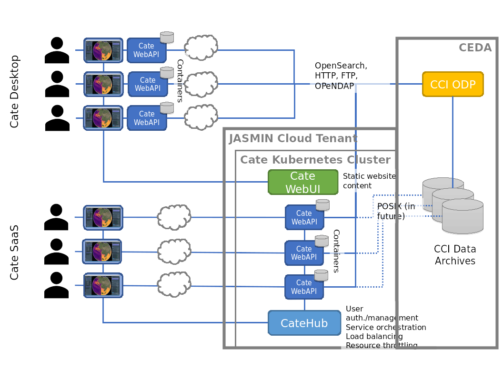

.. _JupyterHub: https://jupyter.org/hub
.. _notebook: https://jupyter.org/
.. _cate-docker: https://github.com/CCI-Tools/cate-docker
.. _cate-desktop: https://github.com/CCI-Tools/cate-desktop
.. _cate-webui: https://github.com/CCI-Tools/cate-webui
__ notebook_

=======
CateHub
=======

CateHub brings power of cate to a group of users. It gives users access to computational resources without a burden of installation and configuration.
This is akin to JupyterHub, and the deployment in cloud environments is heavily derived from it.

This document describes the components, the architecture and deployment of CateHub for cate Software as Service. A live deployment of cate SaaS is described below in section Cate SaaS.

CateHub can be deployed on any cloud provider providing Kubernetes Cluster-as-a-Service (CaaS).

Components
==========
This section provides overview of components of catehub and the schematic below helps illustrate the interaction among various components barring helm chart.

- cate-docker_: is a containerized (docker) cate core that removes the burden of cate installation for single users locally or remotely.Its intended use is through using cate core's web-api (eg., cate-desktop or cate-webui in SaaS environments).In multi-user cloud environment it serves as base container for each user.

- cate-desktop_: is a desktop GUI application that serves as frontend option to use cate core. The application can connect to remote service or local installation of cate (using option Service at Given URL). These options shown at welcome screen are illustrated in figure below.In future cate-desktop may support use of both local and remote data stores in its workspaces.

   Welcome screen of cate-desktop providing options to select location of cate service.

 - cate-webui_: is remote counter part to cate-desktop, a web GUI for cate. It removes need for cate-desktop for interested users. Its intended use is for cate SaaS.cate-webui is the core component of cate-desktop.

- JupyterHub_ Architecture:
  is used for spwaping cate-docker containers for multiple users and . THis is through its REST API. Us
  instead of creating a application with API to spawn cate-docker containers for users we took advantage of
  It is illustrative to see the components at its documentation page, kubespawner and reversable http proxy.
  Authentication and authorization. Depending on the configuration JupyterHub may also provide authentication.
- kubernetes cluster
  nginx load balancing incoming requests, scheduling pods, comtainer image updates, monitor its heath for resiliance.

  Multiuser, node js configurable http https://jupyterhub.readthedocs.io/en/1.1.0/
 JupyterHub also provides easier deploy using helm.

  kubernetes as cluster, first part gives example CaaS that can be used to deploy on any cloud provider Kubernetes Cluster as a Service.
configuration is made simple using helm chart.

- helm chart:
  provides template and minimal confugration for catehub would be
  https://zero-to-jupyterhub.readthedocs.io/en/latest/

  Authentication component

.. code-block:: yaml

     name: catehub
     image:
        name: quay.io/bcdev/cate-webapi-k8s
        tag: 2.1.0.dev0.build15
     extraEnv:
        CATE_USER_ROOT: "/home/cate"
     kubespawner_override:
        cmd: ["/bin/bash", "-c", "source activate cate-env && cate-webapi-start -v -p 8888 -a 0.0.0.0"]

Schematic goes here illustrating interaction among components.

Cate SaaS
==========
A deployed CateHub can be navigated https://cate-webui.192.171.139.57.xip.io/

link to JASMINT
Authentication, Authorization

Schematic:

