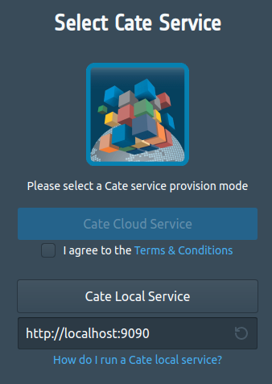

.. _Cate-README: https://github.com/CCI-Tools/cate/blob/master/README.md#installation-from-sources

=========
API Usage
=========

.. _install_sources:

Installing Sources
==================

To start developing for Cate, first make sure you have installed the Cate sources as described
in :ref:`install_cate_from_sources`.

You can then run the Cate Web API Service from the command line.
To run the service on port 9090 on your local computer, type:

.. code-block:: console

    $ cate-webapi-start --port 9090

If you wish to run a service with limited file system access (sandboxed),
you can specify the root option that defines a new file system root:

.. code-block:: console

    $ cate-webapi-start --port 9090 --root /home/fritz

Use CTRL+C or the command

.. code-block:: console

    $ cate-webapi-stop --port 9090

to stop the service.

To access the Web API Service, you can simply select it from the
start screen of `cate.climate.esa.int`.

However, in some cases you may want to run your own local instance of Cate App,
probably because you have made some changes there, too.

To do so, follow the instructions given at :ref:`install_cate_app_from_sources`.

Main Packages
=============

Cate's main packages are as follows:

**core**: Cate's core API.
It contains

* the functionality to access data sets and data stores
* the generic implementation of operators
* the functionality to define workflows
* Cate's plugin mechanism

**cli**: Cate's command line interface

**conf**: Provides Cate's API for handling configuration, which may be
given via variables or files

**ds**: Supporting package that serves to create the data stores that are used
within cate.
This package has no functional code besides the one in its __init.py__.

**ops**: Contains Cate's specific Operator implementations.

**util**: Provides various utility functions.
This package can be used stand-alone.

**webapi**: Cate's WebAPI Service.
Provides the functionality to run cate as a service,
in particular a WebSocketService.

You can learn more about the packages in :ref:`detailed-design`.

Basic Examples
==============

This section gives a few examples on how to use the Cate API.

Opening Datasets
----------------

.. code-block:: python

    from cate.core.ds import open_dataset
    dataset = open_dataset('my_data.zarr',
                           time_range=('2001-01-01', '2002-12-31'),
                           region=(-180, 90, 180, 90),
                           var_names=['sst', 'adg_412'],
                           data_store_id='my-store',
                           force_local: False,
    )

Note that any argument except the dataset ID is optional.
To first get an overview about which datasets are available, do the following:

.. code-block:: python

    from cate.core.ds import DATA_STORE_POOL
    data_store = DATA_STORE_POOL.get_store(data_store_id)
    data_ids = list(data_store.get_data_ids())

To see, which data Store id's are available, do this:

.. code-block:: python

    from cate.core.ds import DATA_STORE_POOL
    store_ids = DATA_STORE_POOl.store_instance_ids
    data_store = DATA_STORE_POOL.get_store(data_store_id)

Applying operations
-------------------

The easiest way to use an operation is to directly import it from the `cate.ops` package, e.g., like

.. code-block:: python

    import xarray as xr
    from cate.ops import long_term_average

    ds = xr.Dataset(...)
    actual = long_term_average(ds)

However, this section gives insight into how the operations can be accessed in a more programmatic and generic way.
You may get a list of provided operations like this:

.. code-block:: python

    from cate.core.op import OP_REGISTRY
    operation_registrations = OP_REGISTRY.op_registrations

This will give you a dictionary where the keys are the operation names and the values are information about the
operations, including their keyword arguments.

To apply an operation, you can do this:

.. code-block:: python

    from cate.core.op import OP_REGISTRY
    op = OP_REGISTRY.get_op(op_name)
    op(**op_kwargs)

Storing Data
------------

To store data in Cate's local store, you have two options:

If you have the data in your code as an  xarray dataset:

.. code-block:: python

    from cate.core.ds import make_local
    make_local(data,
               local_name='new_data_name'
    )

If the data is located on your local drive:

.. code-block:: python

    from cate.core.ds import add_as_local
    add_as_local('new_data_name',
                 'path/to/first/file',
                 'path/to/second/file',
                 '...'
    )

Also consider the API reference :ref:`api_reference`.
