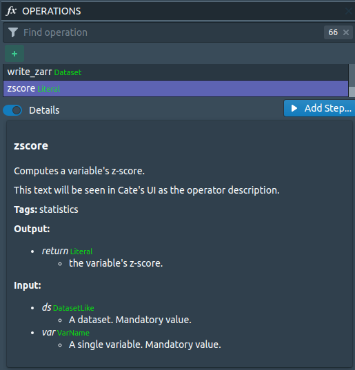

==================
Plugin Development
==================

The possibility to extend cate through plugins is one of the main characteristics
of cate.
In many cases, it serves as an excellent point for third party-developers to
contribute to cate or to customize cate to their needs.

Before you start, make sure that you have installed the cate sources
(see here: :ref:`install_sources`).
You may also find the chapter on API usage useful: :ref:`api_reference`
and in particular this section: :ref:`core_plugin`

Plugin Entry Point
==================

Cate's plugin functionality is a way to integrate your own code into Cate.
To use it, you must implement a method called `cate_init` and register it in the
setup.py of your project like this:

.. code-block:: python

    setup(
        ...
        entry_points={
            'cate_plugins': [
                '<plugin_name> = <package>.<path>:cate_init'
            ],
        },
    )

When you execute `python setup.py develop`, the plugin is found by cate and the
code in your `cate_init` is executed when cate is started.

Example: Adding an Operation
============================

Here we show how you can add your own operation, using cate's extension point for
operations.
Let's say you have a simple operation to compute a variable's z-score.
The operation requires cate's dedicated operation decorators to be recognized
as operation.
You can read about them here: :ref:`dd-cate-core-op`

.. code-block:: python

    from cate.core.op import op, op_input, op_return
    from cate.core.types import DatasetLike, VarName, Literal

    @op(tags=['statistics'], version='0.1')
    @op_input('ds', data_type=DatasetLike)
    @op_input('var', value_set_source='ds', data_type=VarName)
    @op_return(data_type=Literal)
    def zscore(ds: DatasetLike.TYPE, var: VarName.TYPE) -> Literal.TYPE:
        """
        Computes a variable's z-score.

        This text will be seen in Cate's UI as the operator description.

        :param ds: A dataset
        :param var: A single variable

        :return: the variable's z-score
        """

        ds = DatasetLike.convert(ds)
        var = VarName.convert(var)

        variable = ds[var]

        mean = variable.mean(dim='time', skipna=True)
        std = variable.std(dim='time', skipna=True)

        return Literal.convert((variable - mean) / std)

Say you have this code in a module named `zscore.py`.
You can then refer to it from your package's `__init.py__` like this:

.. code-block:: python

    def cate_init():
        # Plugin initializer.
        # Left empty because operations are registered automatically via decorators.
        pass

    from .zscore import zscore

That's all.
We did not need to implement `cate_init` here, as the relevant part is that
its mere presence causes that the module is loaded at runtime, and therefore
the decorators register the operation.

In Cate, the operation will then appear like this:

