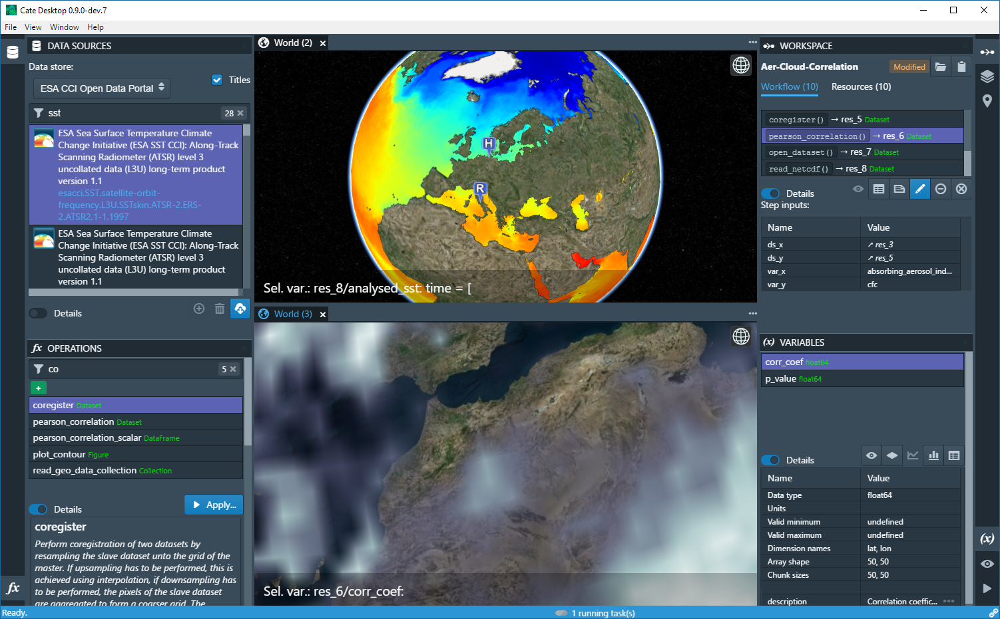

.. Cate documentation master file

==========================
Cate - The ESA CCI Toolbox
==========================

.. toctree::
   :caption: Table of Contents
   :maxdepth: 1
   :numbered:

   introduction
   about
   quick_start
   user_manual
   use_cases
   op_specs
   architecture
   api_reference
   detailed_design
   downloads
   support
   developer_guide
   terminology
   rel_projects

Indices and tables
==================

* :ref:`genindex`
* :ref:`modindex`
* :ref:`search`

