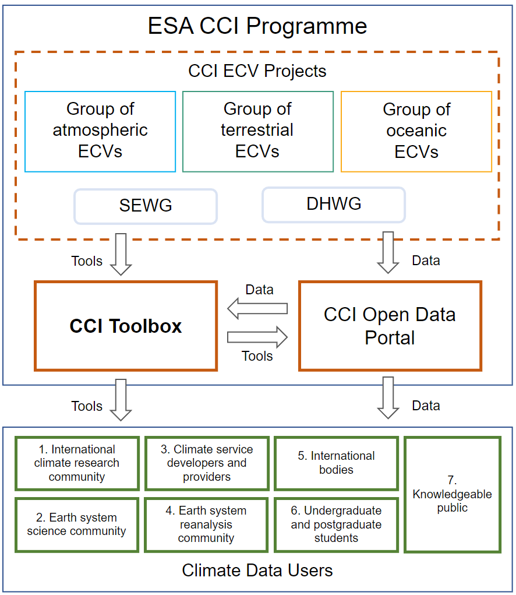

.. _ESA: http://www.esa.int/ESA
.. _Climate Change Initiative: http://cci.esa.int/
.. _GCOS: http://www.wmo.int/pages/prog/gcos/index.php
.. _UNFCCC: http://unfccc.int/2860.php

============
Introduction
============

Project Background
==================

In 2009, ESA_, the European Space Agency, has launched the `Climate Change Initiative`_ (CCI),
a programme to respond the need for climate-quality satellite data as expressed by GCOS_, the Global Climate Observing
System that supports the UNFCCC_, the United Nations Framework Convention on Climate Change.

In the ESA CCI programme **14 Essential Climate Variables** (ECV) are produced by individual expert teams,
and cross-cutting activities provide coordination, harmonisation and support. The **CCI Toolbox** and the
**CCI Open Data Portal** are the two main technical support projects within the programme.
The CCI Open Data Portal will provide a single point of harmonised access to a subset of mature and validated
ECV-related data products. The CCI Toolbox will provide tools that support visualisation, analysis and processing across
CCI and other climate data products. With these two technical cross cutting activities ESA is providing an interface
between its CCI projects and the ECVs generated there, and the wider climate change user community
(see following :numref:`cate_context`).

.. _cate_context:

   CCI Toolbox context

Key Objectives
==============

In this context the four key objectives of the CCI Toolbox are:

* Provide to climate users an intuitive software application that is capable of **ingesting data from all CCI projects**
  and synergistically use this data in a uniform tooling environment.
  This requires the application to abstract from the various data types used to represent the different ECVs
  (vector data, n-D raster data), and from data formats used (NetCDF, Shapefiles), and also from various data sources
  (remote services, local files). A **Common Data Model** (CDM) shall be developed and utilised that can represent
  all data of all ECVs and make it available to a variety of algorithms and converters to different representations.
* Provide to users a rich set of **data processing operations** that implement commonly used climate algorithms
  and which operate solely on the CDM. A processor may generate a new CDM instance as output which again is independent
  from any particular external representation. Processors that use a CDM as input and output can be used to build
  processing chains that represent typical climate workflows.
* Provide to users various **visualisation and analysis** operations.
  Again, these functions will solely operate on the CDM. The majority of visualisation and analysis functions will be
  applicable to multiple ECVs (e.g. 3D visualisations) while other may only work if the CDM fulfils certain constraints
  (e.g. profile data). Some of these functions may generate a new or enrich an existing CDM instance and thus be
  implemented as processors and be used in processing chains.
* Design the **architecture** of the CCI Toolbox so that it **can be extended by new climate operations** and that it
  also allows for **reuse of existing or planned software tools and libraries**. Furthermore allow other scientists and
  tool developers to use the underlying CCI Toolbox algorithms and libraries in their own programs. Scientists are
  used to stay with their preferred programming language, so ideally the CCI Toolbox shall offer application
  programming interfaces (API) for programming languages commonly used in climate science such as Python and R, C and
  FORTRAN.

